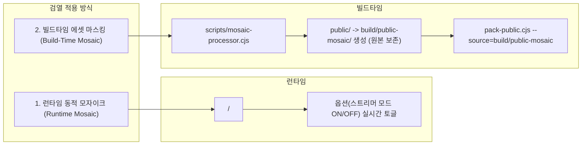

# GBFramework: React + Vite + Electron 게임 개발 프레임워크 가이드 (v3.0 Production)

> **GBFramework (Game Boilerplate Framework)** 는 **React 19 + Vite 6 + Electron 33 + TypeScript + Tailwind CSS 4** 기반의 고성능 2D/웹 기반 독립 실행형(Standalone) 데스크톱 게임을 신속하게 제작하고 배포하기 위한 완전무결한 올인원(All-in-One) 프레임워크 규격서입니다.
> 
> 이 문서는 새로운 게임을 제작할 때 AI 에이전트나 개발자가 프로젝트를 처음부터 즉시 구축하고, 빌드/배포 파이프라인과 다국어, 세이브, 폰트/버튼 UI, 씬/팝업 시스템, Range 스트리밍 및 리소스 보안 시스템을 완벽히 복제 및 적용할 수 있도록 실제 동작하는 완전한 코드를 제공합니다.

---

## 1. 아키텍처 개요

```mermaid
flowchart TD
    subgraph Frontend [렌더러 프로세스 (React 19 + Vite 6)]
        direction TB
        MainEntry["src/main.tsx (Provider Hierarchy)"]
        ErrBound["ErrorBoundary (크래시 방어 & 세이브 플러시)"]
        I18N["i18nProvider (다국어 & 보간 엔진)"]
        FontEngine["fonts.css (다국어 TTF 매핑)"]
        SceneRouter["SceneProvider (FSM 씬 라우터)"]
        Viewport["GameViewport (16:9 반응형 레터박스)"]
        PopupLayer["PopupContainer (LIFO 팝업 스택)"]
        BtnSystem["GameButton (SFX + Framer Motion)"]
        SaveSvc["saveService.ts (JSON 영속화)"]
        MediaResolver["mediaUrl.ts (media:// 변환)"]
        CensorEngine["CensorshipProvider (선택적 검열/스트리머 모드)"]

        MainEntry --> ErrBound --> I18N --> CensorEngine --> SceneRouter --> Viewport
        Viewport --> FontEngine
        Viewport --> PopupLayer
        Viewport --> BtnSystem
        Viewport --> SaveSvc
        Viewport --> MediaResolver
    end

    subgraph Backend [메인 프로세스 (Electron 33)]
        direction TB
        MainProc["electron/main.cjs (메인 프로세스)"]
        Preload["electron/preload.cjs (안전한 contextBridge)"]
        PakStream["gamePak.cjs (XOR 복호화 & Web Stream)"]
        CustomProto["media:// 프로토콜 핸들러 (Range 206 / MIME)"]
        Lifecycle["Window Lifecycle (minimize/restore 감지)"]
        IPC["IPC 핸들러 (화면 모드 / 포장 여부)"]

        MainProc --> Preload
        MainProc --> CustomProto
        MainProc --> Lifecycle
        MainProc --> IPC
        CustomProto --> PakStream
    end

    subgraph Storage [저장소 & 빌드 자산]
        direction TB
        PublicDir["public/ (원본 리소스)"]
        MosaicScript["scripts/mosaic-processor.cjs (심의용 마스킹)"]
        PackScript["scripts/pack-public.cjs"]
        GameDat["build/game.dat (암호화 번들)"]
        PortableExe["dist-electron/Game.exe (단일 실행기)"]

        PublicDir --> MosaicScript --> PackScript --> GameDat
        PakStream --> GameDat
        GameDat --> PortableExe
    end

    MediaResolver -->|"media:// 요청 (Range/Seek 지원)"| CustomProto
    Lifecycle -.->|"window-lifecycle IPC"| Frontend
    SaveSvc -->|"localStorage JSON 저장"| LocalStorage["Web Storage (localStorage)"]
```

---

## 2. 프로젝트 표준 구조 및 버전 매트릭스

### 2.1 버전 호환성 매트릭스
| 기술 | 권장 버전 | 비고 |
| :--- | :--- | :--- |
| **Node.js** | `>= 20.18.0` (LTS) | `Readable.toWeb()` 및 최신 Web Streams API 지원 필수 |
| **Electron** | `^33.2.0` | Chromium 130 기반, `protocol.handle` 표준 Web API 준수 |
| **React** | `^19.0.0` | React 19 컴파일러 호환 및 액션 지원 |
| **Vite** | `^6.0.0` | 최신 롤업 엔진 및 빠른 HMR |
| **Tailwind CSS** | `^4.0.0` | `@tailwindcss/vite` 기반 무설정 CSS 엔진 |
| **TypeScript** | `^5.7.0` | 프로젝트 레퍼런스(`tsc -b`) 지원 |

### 2.2 표준 디렉터리 트리 (Directory Layout)
```text
my-game-project/
├── .env.development              # 개발 환경 변수
├── .env.review                   # 심의용 환경 변수 (VITE_REVIEW_BUILD=true)
├── .env.uncensored               # 무검열/성인용 환경 변수
├── build/                        # 빌드 임시 및 생성물
│   ├── icon.ico                  # 윈도우 앱 아이콘 (256x256)
│   ├── game.dat                  # pack-public 스크립트로 생성된 에셋 번들
│   └── public-mosaic/            # (심의 빌드 시 생성) 모자이크 처리된 임시 에셋 폴더
├── dist/                         # Vite 웹 빌드 결과물 (HTML/JS/CSS)
├── dist-electron/                # 최종 Windows 실행 파일 (.exe)
├── dist-electron-review/         # 심의용 Windows 실행 파일 (.exe)
├── dist-electron-uncensored/     # 무검열 Windows 실행 파일 (.exe)
├── electron/                     # Electron 메인 프로세스
│   ├── main.cjs                  # 메인 프로세스 진입점 및 IPC/프로토콜 설정
│   ├── preload.cjs               # contextBridge를 통한 렌더러 안전 API 노출
│   └── gamePak.cjs               # game.dat 패킹/언패킹 및 XOR 스트림 모듈
├── public/                       # 정적 리소스 원본 (game.dat로 패킹 대상, 원본 보존)
│   ├── bgm/                      # 배경음악 (.mp3, .ogg)
│   ├── sfx/                      # 효과음 (.mp3, .wav)
│   ├── illustrations/            # 일러스트 및 컷씬 (.webp, .webm)
│   └── loading_splash.bmp        # 포터블 실행기 스플래시 이미지
├── scripts/                      # 빌드 & 유틸리티 스크립트
│   ├── mosaic-processor.cjs      # (선택) 심의용 물리적 에셋 모자이크 처리 (public-mosaic 생성)
│   ├── pack-public.cjs           # public/ -> build/game.dat 암호화 패킹 (--source 지원)
│   └── reset-electron-saves.cjs  # 빌드 전 임시 세이브 초기화
├── src/                          # React 렌더러 소스 코드
│   ├── assets/                   # 소스 코드 내부 번들 에셋
│   │   └── fonts/                # 언어별 TTF/WOFF2 폰트 파일
│   ├── components/               # 재사용 가능한 UI 및 레이아웃
│   │   ├── ErrorBoundary.tsx     # 런타임 에러 복구 및 세이브 보호
│   │   ├── GameButton.tsx        # 사운드/모션 내장 게임 버튼
│   │   ├── GameViewport.tsx      # 16:9 고정 비율 반응형 컨테이너
│   │   ├── ModalScreenWrapper.tsx# 공통 팝업 래퍼 (백드롭 + 모션)
│   │   ├── MosaicCanvas.tsx      # (선택) 런타임 Canvas 동적 모자이크
│   │   ├── MosaicOverlay.tsx     # (선택) 반응형 블러/딤 오버레이
│   │   └── PopupContainer.tsx    # LIFO 팝업 스택 렌더러
│   ├── game/                     # 순수 게임 로직, 상태 및 서비스
│   │   ├── appLifecycle.ts       # 윈도우 최소화/복원 오디오 관리
│   │   ├── bgm.ts                # 배경음악 제어 및 오디오 언락
│   │   ├── uiSfx.ts              # 효과음 풀링 및 재생
│   │   ├── mediaUrl.ts           # media:// URL 리졸버
│   │   ├── mediaCleanup.ts       # 미디어 DOM/Blob 메모리 해제 유틸
│   │   ├── mosaicTypes.ts        # (선택) 모자이크 영역 공용 타입 및 좌표 변환기
│   │   ├── mosaic-manifest.json  # (선택) 심의용 모자이크 영역 좌표 정의 파일
│   │   ├── censorshipContext.tsx # (선택) 검열 및 스트리머 모드 전역 컨텍스트
│   │   ├── popupStore.ts         # 팝업 스택 상태 스토어
│   │   ├── save.ts               # 세이브 데이터 인터페이스 정의
│   │   ├── saveService.ts        # 세이브/로드 및 자동 저장
│   │   ├── saveMigration.ts      # 세이브 버전 마이그레이션 파이프라인
│   │   ├── sceneTypes.ts         # 씬/모달 타입 정의
│   │   ├── SceneRouter.tsx       # 씬 전환 FSM 라우터 컨텍스트
│   │   └── useGlobalKeyControls.ts # ESC, F11, Space/Enter 전역 키 제어
│   ├── locales/                  # 다국어 번역 파일
│   │   ├── KO.json
│   │   ├── EN.json
│   │   ├── JA.json
│   │   └── i18n.tsx              # 보간(interpolation) 지원 i18n 시스템
│   ├── screens/                  # 씬별 화면 컴포넌트
│   │   ├── CompanyLogoSplash.tsx # 인트로/스플래시 및 오디오 언락
│   │   ├── MainMenu.tsx          # 타이틀 메뉴
│   │   ├── InGame.tsx            # 메인 인게임 플레이
│   │   ├── EndingGalleryPanel.tsx# 엔딩 크레딧 및 갤러리
│   │   ├── EditorScreen.tsx      # 디버그 에디터
│   │   ├── SaveListPanel.tsx     # 세이브/로드 팝업 화면
│   │   └── SettingsPanel.tsx     # 설정 팝업 화면
│   ├── App.tsx                   # 최상위 씬 스위처
│   ├── fonts.css                 # 언어별 @font-face 정의
│   ├── index.css                 # Tailwind 4 및 글로벌 스타일
│   ├── main.tsx                  # React 렌더러 진입점
│   └── vite-env.d.ts             # 환경 변수 및 electronAPI 타입 선언
├── build-electron.bat            # 윈도우 배포 빌드 원클릭 배치
├── electron-builder.json         # 기본 상용 배포 빌드 설정
├── electron-builder.review.json  # 심의용 배포 빌드 설정
├── electron-builder.uncensored.json # 무검열 배포 빌드 설정
├── package.json                  # 프로젝트 메타데이터 및 의존성
├── start-dev.bat                 # 개발 모드 원클릭 실행 배치
├── tsconfig.json                 # TS 루트 설정
├── tsconfig.app.json             # 렌더러 TS 설정
├── tsconfig.node.json            # Node/Vite TS 설정
└── vite.config.ts                # Vite 번들러 설정
```

---

## 3. 핵심 설정 파일 템플릿

### 3.1 `package.json`
```json
{
  "name": "my-awesome-game",
  "private": true,
  "version": "1.0.0",
  "description": "GBFramework 기반 데스크톱 게임",
  "type": "module",
  "main": "electron/main.cjs",
  "engines": {
    "node": ">=20.18.0"
  },
  "scripts": {
    "dev": "concurrently -k --kill-signal SIGTERM -s command-electron -n vite,electron -c cyan,magenta \"vite\" \"wait-on http://localhost:5173 && cross-env ELECTRON_DEV=1 electron .\"",
    "build": "tsc -b && vite build",
    "pack:assets": "node scripts/pack-public.cjs",
    "build:electron": "node scripts/reset-electron-saves.cjs && tsc -b && vite build && node scripts/pack-public.cjs && electron-builder --win --config electron-builder.json",
    "build:electron:review": "node scripts/reset-electron-saves.cjs && node scripts/mosaic-processor.cjs && tsc -b && vite build --mode review && node scripts/pack-public.cjs --source=build/public-mosaic && electron-builder --win --config electron-builder.review.json",
    "build:electron:uncensored": "node scripts/reset-electron-saves.cjs && tsc -b && vite build --mode uncensored && node scripts/pack-public.cjs && electron-builder --win --config electron-builder.uncensored.json",
    "start": "electron .",
    "lint": "oxlint",
    "preview": "vite preview"
  },
  "dependencies": {
    "framer-motion": "^12.0.0",
    "react": "^19.0.0",
    "react-dom": "^19.0.0"
  },
  "devDependencies": {
    "@tailwindcss/vite": "^4.0.0",
    "@types/node": "^22.10.0",
    "@types/react": "^19.0.0",
    "@types/react-dom": "^19.0.0",
    "@vitejs/plugin-react": "^4.3.0",
    "concurrently": "^9.1.0",
    "cross-env": "^7.0.3",
    "electron": "^33.2.0",
    "electron-builder": "^25.1.8",
    "oxlint": "^0.15.0",
    "sharp": "^0.33.5",
    "tailwindcss": "^4.0.0",
    "typescript": "^5.7.0",
    "wait-on": "^8.0.1"
  }
}
```

### 3.2 `electron-builder.json` 계열 빌드 설정
```json
// electron-builder.json (기본 상용판)
{
  "appId": "com.company.mygame",
  "productName": "MyGame",
  "directories": {
    "output": "dist-electron"
  },
  "asar": true,
  "files": [
    "dist/**/*",
    "!dist/**/*.map",
    "electron/**/*",
    "package.json"
  ],
  "extraResources": [
    {
      "from": "build/game.dat",
      "to": "game.dat"
    }
  ],
  "win": {
    "icon": "build/icon.ico",
    "target": [
      "portable"
    ]
  },
  "portable": {
    "splashImage": "public/loading_splash.bmp"
  }
}
```

```json
// electron-builder.review.json (심의용 배포판)
{
  "appId": "com.company.mygame.review",
  "productName": "MyGame_Review",
  "directories": {
    "output": "dist-electron-review"
  },
  "asar": true,
  "files": [
    "dist/**/*",
    "!dist/**/*.map",
    "electron/**/*",
    "package.json"
  ],
  "extraResources": [
    {
      "from": "build/game.dat",
      "to": "game.dat"
    }
  ],
  "win": {
    "icon": "build/icon.ico",
    "target": [
      "portable"
    ]
  },
  "portable": {
    "splashImage": "public/loading_splash.bmp"
  }
}
```

```json
// electron-builder.uncensored.json (무검열판)
{
  "appId": "com.company.mygame.uncensored",
  "productName": "MyGame_Uncensored",
  "directories": {
    "output": "dist-electron-uncensored"
  },
  "asar": true,
  "files": [
    "dist/**/*",
    "!dist/**/*.map",
    "electron/**/*",
    "package.json"
  ],
  "extraResources": [
    {
      "from": "build/game.dat",
      "to": "game.dat"
    }
  ],
  "win": {
    "icon": "build/icon.ico",
    "target": [
      "portable"
    ]
  },
  "portable": {
    "splashImage": "public/loading_splash.bmp"
  }
}
```

### 3.3 `vite.config.ts`
```typescript
import { defineConfig } from 'vite'
import react from '@vitejs/plugin-react'
import tailwindcss from '@tailwindcss/vite'
import path from 'path'

export default defineConfig({
  plugins: [
    react(),
    tailwindcss(),
  ],
  base: './', // Electron 상용 패키징 시 상대 경로 필수
  resolve: {
    alias: {
      '@': path.resolve(__dirname, './src'),
    },
  },
  server: {
    port: 5173,
    strictPort: true,
  },
  build: {
    outDir: 'dist',
    emptyOutDir: true,
    sourcemap: false,
    chunkSizeWarningLimit: 2000,
  },
})
```

### 3.4 TypeScript 설정 (`tsconfig.json`, `tsconfig.app.json`, `tsconfig.node.json`)
```json
// tsconfig.json
{
  "files": [],
  "references": [
    { "path": "./tsconfig.app.json" },
    { "path": "./tsconfig.node.json" }
  ]
}
```

```json
// tsconfig.app.json
{
  "compilerOptions": {
    "target": "ES2022",
    "useDefineForClassFields": true,
    "lib": ["ES2022", "DOM", "DOM.Iterable"],
    "module": "ESNext",
    "skipLibCheck": true,
    "moduleResolution": "bundler",
    "allowImportingTsExtensions": true,
    "isolatedModules": true,
    "moduleDetection": "force",
    "noEmit": true,
    "jsx": "react-jsx",
    "strict": true,
    "noUnusedLocals": true,
    "noUnusedParameters": true,
    "noFallthroughCasesInSwitch": true,
    "baseUrl": ".",
    "paths": {
      "@/*": ["src/*"]
    }
  },
  "include": ["src"]
}
```

```json
// tsconfig.node.json
{
  "compilerOptions": {
    "target": "ES2022",
    "lib": ["ES2023"],
    "module": "ESNext",
    "skipLibCheck": true,
    "moduleResolution": "bundler",
    "allowSyntheticDefaultImports": true,
    "isolatedModules": true,
    "moduleDetection": "force",
    "noEmit": true,
    "strict": true
  },
  "include": ["vite.config.ts"]
}
```

### 3.5 환경 변수 파일 (`.env.development`, `.env.review`, `.env.uncensored`)
```ini
# .env.development
VITE_REVIEW_BUILD=false
VITE_DISABLE_MOSAIC=false
VITE_PLATFORM=standalone
```

```ini
# .env.review
VITE_REVIEW_BUILD=true
VITE_DISABLE_MOSAIC=false
VITE_PLATFORM=standalone
```

```ini
# .env.uncensored
VITE_REVIEW_BUILD=false
VITE_DISABLE_MOSAIC=true
VITE_PLATFORM=standalone
```

### 3.6 환경 타입 선언 (`src/vite-env.d.ts`)
```typescript
/// <reference types="vite/client" />

interface ImportMetaEnv {
  readonly VITE_REVIEW_BUILD?: string
  readonly VITE_DISABLE_MOSAIC?: string
  readonly VITE_PLATFORM?: 'steam' | 'stove' | 'standalone'
}

interface ImportMeta {
  readonly env: ImportMetaEnv
}

interface ElectronAPI {
  onWindowLifecycle: (callback: (state: 'suspended' | 'resumed') => void) => () => void
  setDisplayMode: (mode: 'fullscreen' | 'borderless' | 'windowed') => Promise<boolean>
  toggleFullscreen: () => Promise<boolean>
  isPackaged: () => Promise<boolean>
}

interface Window {
  electronAPI?: ElectronAPI
}
```

---

## 4. 리소스 암호화 및 Range(206) 스트리밍 파이프라인

게임 에셋을 XOR 암호화하여 `build/game.dat`로 패킹하고, 런타임에 커스텀 프로토콜(`media://`)로 서빙합니다. **Range 요청(206 Partial Content)을 완벽 지원**하여 컷신 동영상 및 BGM 탐색(seek) 시 딜레이가 없습니다.

### 4.1 패커 스크립트 (`scripts/pack-public.cjs`)
```javascript
const fs = require('fs')
const path = require('path')
const { MAGIC, xorInPlace } = require('../electron/gamePak.cjs')

const ROOT = path.resolve(__dirname, '..')
const args = process.argv.slice(2)
const sourceArg = args.find((a) => a.startsWith('--source='))
const PUBLIC_DIR = sourceArg
  ? path.resolve(ROOT, sourceArg.replace('--source=', ''))
  : path.join(ROOT, 'public')

const OUT_DIR = path.join(ROOT, 'build')
const OUT_FILE = path.join(OUT_DIR, 'game.dat')
const CHUNK = 1024 * 1024

function walkFiles(dir, base = dir, acc = []) {
  for (const entry of fs.readdirSync(dir, { withFileTypes: true })) {
    if (entry.name === '.' || entry.name === '..') continue
    const full = path.join(dir, entry.name)
    if (entry.isDirectory()) {
      walkFiles(full, base, acc)
      continue
    }
    if (!entry.isFile()) continue
    if (['Thumbs.db', '.DS_Store', 'loading_splash.bmp'].includes(entry.name)) continue
    acc.push(path.relative(base, full).replace(/\\/g, '/'))
  }
  return acc
}

function xorCopyFile(srcPath, destFd, payloadOffset) {
  const srcFd = fs.openSync(srcPath, 'r')
  const buf = Buffer.alloc(CHUNK)
  let copied = 0
  let n
  while ((n = fs.readSync(srcFd, buf, 0, buf.length, copied)) > 0) {
    const chunk = buf.subarray(0, n)
    xorInPlace(chunk, payloadOffset + copied)
    fs.writeSync(destFd, chunk, 0, n)
    copied += n
  }
  fs.closeSync(srcFd)
  return copied
}

function main() {
  if (!fs.existsSync(PUBLIC_DIR)) {
    throw new Error(`public folder missing: ${PUBLIC_DIR}`)
  }
  fs.mkdirSync(OUT_DIR, { recursive: true })

  const rels = walkFiles(PUBLIC_DIR).sort()
  const payloadTmp = `${OUT_FILE}.payload`
  if (fs.existsSync(payloadTmp)) fs.unlinkSync(payloadTmp)

  const payloadFd = fs.openSync(payloadTmp, 'w')
  const index = {}
  let offset = 0
  for (const rel of rels) {
    const abs = path.join(PUBLIC_DIR, rel)
    const size = xorCopyFile(abs, payloadFd, offset)
    index[rel] = [offset, size]
    offset += size
  }
  fs.closeSync(payloadFd)

  const indexJson = Buffer.from(JSON.stringify(index), 'utf8')
  xorInPlace(indexJson, 0)
  const header = Buffer.alloc(12)
  MAGIC.copy(header, 0)
  header.writeUInt32LE(indexJson.length, 8)

  const outFd = fs.openSync(OUT_FILE, 'w')
  fs.writeSync(outFd, header)
  fs.writeSync(outFd, indexJson)
  const payloadIn = fs.openSync(payloadTmp, 'r')
  const buf = Buffer.alloc(CHUNK)
  let copied = 0
  let n
  while ((n = fs.readSync(payloadIn, buf, 0, buf.length, copied)) > 0) {
    fs.writeSync(outFd, buf, 0, n)
    copied += n
  }
  fs.closeSync(payloadIn)
  fs.closeSync(outFd)
  fs.unlinkSync(payloadTmp)

  const mb = (fs.statSync(OUT_FILE).size / (1024 * 1024)).toFixed(1)
  console.log(`[pack-public] ${rels.length} files -> ${OUT_FILE} (${mb} MB)`)
}

try {
  main()
} catch (err) {
  console.error('[pack-public] failed:', err)
  process.exit(1)
}
```

### 4.2 런타임 언패커 및 XOR 스트림 (`electron/gamePak.cjs`)
```javascript
const fs = require('fs')
const { Transform } = require('stream')

const MAGIC = Buffer.from('GBPAK01\0')
const KEY = Buffer.from([0x42, 0x47, 0x8a, 0x31, 0xc4, 0x77, 0x09, 0xe2, 0x5d, 0x13, 0xa8, 0x6f])

function xorInPlace(buf, startOffset) {
  const keyLen = KEY.length
  for (let i = 0; i < buf.length; i++) {
    buf[i] ^= KEY[(startOffset + i) % keyLen]
  }
  return buf
}

class XorTransform extends Transform {
  constructor(startOffset) {
    super()
    this.offset = startOffset
  }
  _transform(chunk, _enc, cb) {
    const out = Buffer.from(chunk)
    xorInPlace(out, this.offset)
    this.offset += out.length
    cb(null, out)
  }
}

function open(filePath) {
  const fd = fs.openSync(filePath, 'r')
  const header = Buffer.alloc(12)
  if (fs.readSync(fd, header, 0, 12, 0) !== 12) {
    fs.closeSync(fd)
    throw new Error('game.dat header truncated')
  }
  if (!header.subarray(0, 8).equals(MAGIC)) {
    fs.closeSync(fd)
    throw new Error('game.dat magic mismatch')
  }
  const indexLen = header.readUInt32LE(8)
  const indexBuf = Buffer.alloc(indexLen)
  if (fs.readSync(fd, indexBuf, 0, indexLen, 12) !== indexLen) {
    fs.closeSync(fd)
    throw new Error('game.dat index truncated')
  }
  xorInPlace(indexBuf, 0)
  const parsed = JSON.parse(indexBuf.toString('utf8'))
  const index = new Map()
  for (const [key, value] of Object.entries(parsed)) {
    const rel = String(key).replace(/\\/g, '/')
    if (!Array.isArray(value) || value.length < 2) continue
    index.set(rel, { offset: Number(value[0]), size: Number(value[1]) })
  }
  return { filePath, fd, index, payloadStart: 12 + indexLen }
}

function createEntryStream(pak, entry, start = 0, end = entry.size - 1) {
  const from = Math.max(0, start)
  const to = Math.min(entry.size - 1, end)
  const absStart = pak.payloadStart + entry.offset + from
  const absEnd = pak.payloadStart + entry.offset + to
  const raw = fs.createReadStream(pak.filePath, { start: absStart, end: absEnd })
  return raw.pipe(new XorTransform(entry.offset + from))
}

module.exports = { MAGIC, KEY, XorTransform, xorInPlace, open, createEntryStream }
```

### 4.3 `mediaUrl.ts` URL 리졸버 (`src/game/mediaUrl.ts`)
```typescript
/**
 * 상대 경로('bgm/title.mp3' 또는 '/bgm/title.mp3')를 media:// 정규 프로토콜 URL로 변환합니다.
 */
export function resolveMediaUrl(path: string): string {
  if (!path) return ''
  if (path.startsWith('media://') || path.startsWith('http://') || path.startsWith('https://') || path.startsWith('blob:') || path.startsWith('data:')) {
    return path
  }
  const cleanPath = path.replace(/^\/+/, '')
  return `media://${cleanPath}`
}
```

---

## 5. Electron 메인 프로세스 및 Preload 브릿지

### 5.1 Electron 메인 프로세스 진입점 (`electron/main.cjs`)

```javascript
const { app, BrowserWindow, protocol, net, ipcMain } = require('electron')
const path = require('path')
const fs = require('fs')
const { Readable } = require('stream')
const { pathToFileURL } = require('url')
const gamePak = require('./gamePak.cjs')

let mainWindow = null
let pakState = null
const isDev = process.env.ELECTRON_DEV === '1'

// 1. 크로미움 하드웨어 가속 및 스위치 설정
app.commandLine.appendSwitch('enable-gpu-rasterization')
app.commandLine.appendSwitch('enable-zero-copy')
app.commandLine.appendSwitch('ignore-gpu-blocklist')
app.commandLine.appendSwitch('enable-accelerated-video-decode')
app.commandLine.appendSwitch('disable-renderer-backgrounding')
app.commandLine.appendSwitch('disable-background-timer-throttling')

// 2. media:// 프로토콜 권한 등록 (app.whenReady 이전 필수)
protocol.registerSchemesAsPrivileged([
  {
    scheme: 'media',
    privileges: {
      standard: true,
      secure: true,
      supportFetchAPI: true,
      stream: true,
      corsEnabled: true,
    },
  },
])

const MIME_TYPES = {
  '.html': 'text/html',
  '.js': 'text/javascript',
  '.css': 'text/css',
  '.json': 'application/json',
  '.png': 'image/png',
  '.jpg': 'image/jpeg',
  '.jpeg': 'image/jpeg',
  '.webp': 'image/webp',
  '.gif': 'image/gif',
  '.svg': 'image/svg+xml',
  '.mp3': 'audio/mpeg',
  '.ogg': 'audio/ogg',
  '.wav': 'audio/wav',
  '.webm': 'video/webm',
  '.mp4': 'video/mp4',
}

function getMimeType(filePath) {
  const ext = path.extname(filePath).toLowerCase()
  return MIME_TYPES[ext] || 'application/octet-stream'
}

function initPak() {
  if (app.isPackaged) {
    const datPath = path.join(process.resourcesPath, 'game.dat')
    if (fs.existsSync(datPath)) {
      pakState = gamePak.open(datPath)
      console.log('[pak] loaded game.dat entries:', pakState.index.size)
    } else {
      console.warn('[pak] game.dat missing at', datPath)
    }
  }
}

function setupMediaProtocol() {
  protocol.handle('media', (request) => {
    const url = new URL(request.url)
    // standard: true일 때 host와 pathname이 분리되므로 반드시 결합하여 파싱
    const pathname = decodeURIComponent((url.host + url.pathname).replace(/^\/+/, ''))
    const contentType = getMimeType(pathname)

    // 1. 패키징 환경: game.dat에서 스트리밍 (Range 206 지원)
    if (pakState && pakState.index.has(pathname)) {
      const entry = pakState.index.get(pathname)

      // HEAD 요청 대응 (body 없는 메타데이터 응답)
      if (request.method === 'HEAD') {
        return new Response(null, {
          status: 200,
          headers: {
            'Content-Type': contentType,
            'Content-Length': String(entry.size),
            'Accept-Ranges': 'bytes',
          },
        })
      }

      const rangeHeader = request.headers.get('Range')
      if (rangeHeader) {
        const m = /bytes=(\d+)-(\d*)/.exec(rangeHeader)
        if (m) {
          const start = parseInt(m[1], 10)
          // Range 헤더 유효성 검증: 범위 초과 시 416 Range Not Satisfiable 반환
          if (start > entry.size - 1 || (m[2] && parseInt(m[2], 10) < start)) {
            return new Response(null, {
              status: 416,
              headers: { 'Content-Range': `bytes */${entry.size}` },
            })
          }

          const end = Math.min(
            m[2] ? parseInt(m[2], 10) : entry.size - 1,
            entry.size - 1
          )
          const nodeStream = gamePak.createEntryStream(pakState, entry, start, end)
          const webStream = Readable.toWeb(nodeStream)

          return new Response(webStream, {
            status: 206,
            headers: {
              'Content-Type': contentType,
              'Content-Range': `bytes ${start}-${end}/${entry.size}`,
              'Content-Length': String(end - start + 1),
              'Accept-Ranges': 'bytes',
              'Cache-Control': 'public, max-age=31536000',
            },
          })
        }
      }

      // 일반 200 전체 응답
      const nodeStream = gamePak.createEntryStream(pakState, entry, 0, entry.size - 1)
      const webStream = Readable.toWeb(nodeStream)

      return new Response(webStream, {
        status: 200,
        headers: {
          'Content-Type': contentType,
          'Content-Length': String(entry.size),
          'Accept-Ranges': 'bytes',
          'Cache-Control': 'public, max-age=31536000',
        },
      })
    }

    // 2. 개발 환경: local public/ 폴더에서 직접 서빙 (Path Traversal 방어 & Windows pathToFileURL)
    if (isDev) {
      const PUBLIC_ROOT = path.resolve(__dirname, '../public')
      const localFile = path.resolve(PUBLIC_ROOT, pathname)

      if (!localFile.startsWith(PUBLIC_ROOT + path.sep) && localFile !== PUBLIC_ROOT) {
        return new Response('Forbidden', { status: 403 })
      }

      if (fs.existsSync(localFile) && fs.statSync(localFile).isFile()) {
        return net.fetch(pathToFileURL(localFile).toString())
      }
    }

    return new Response('Not Found', { status: 404 })
  })
}

function emitWindowLifecycle(win, state) {
  if (!win || win.isDestroyed()) return
  try {
    win.webContents.send('window-lifecycle', state)
  } catch {}
}

function registerIpcHandlers() {
  ipcMain.handle('set-display-mode', (event, mode) => {
    const win = BrowserWindow.fromWebContents(event.sender)
    if (!win || win.isDestroyed()) return false

    if (mode === 'fullscreen') {
      win.setFullScreen(true)
    } else if (mode === 'borderless') {
      win.setFullScreen(false)
      win.maximize()
    } else {
      win.setFullScreen(false)
      win.unmaximize()
      win.setSize(1280, 720)
      win.center()
    }
    return true
  })

  ipcMain.handle('toggle-fullscreen', (event) => {
    const win = BrowserWindow.fromWebContents(event.sender)
    if (!win || win.isDestroyed()) return false
    const next = !win.isFullScreen()
    win.setFullScreen(next)
    return next
  })

  ipcMain.handle('is-packaged', () => app.isPackaged)
}

function createMainWindow() {
  mainWindow = new BrowserWindow({
    width: 1920,
    height: 1080,
    minWidth: 1280,
    minHeight: 720,
    show: false,
    frame: true,
    autoHideMenuBar: true,
    webPreferences: {
      preload: path.join(__dirname, 'preload.cjs'),
      contextIsolation: true,
      nodeIntegration: false,
      sandbox: true,
    },
  })

  // 창 라이프사이클 이벤트: 알림/팝업으로 인한 단순 blur 시 BGM 끊김을 방지하고 최소화/복원에만 반응
  mainWindow.on('minimize', () => emitWindowLifecycle(mainWindow, 'suspended'))
  mainWindow.on('restore', () => emitWindowLifecycle(mainWindow, 'resumed'))

  // 상용 빌드 시 새로고침 방지
  mainWindow.webContents.on('before-input-event', (event, input) => {
    if (app.isPackaged) {
      if (input.key === 'F5' || (input.control && input.key.toLowerCase() === 'r')) {
        event.preventDefault()
      }
    }
  })

  mainWindow.once('ready-to-show', () => {
    mainWindow.maximize()
    mainWindow.show()
  })

  if (isDev) {
    mainWindow.loadURL('http://localhost:5173')
    mainWindow.webContents.openDevTools()
  } else {
    mainWindow.loadFile(path.join(__dirname, '../dist/index.html'))
  }
}

// 앱 라이프사이클 구동
app.whenReady().then(() => {
  initPak()
  setupMediaProtocol()
  registerIpcHandlers()
  createMainWindow()

  app.on('activate', () => {
    if (BrowserWindow.getAllWindows().length === 0) createMainWindow()
  })
})

app.on('window-all-closed', () => {
  if (process.platform !== 'darwin') app.quit()
})
```

---

### 5.2 Preload 안전 브릿지 스크립트 (`electron/preload.cjs`)

Electron 메인 프로세스와 프론트엔드 React 렌더러 간 안전한 `window.electronAPI` 통신 채널을 노출합니다.

```javascript
// electron/preload.cjs
const { contextBridge, ipcRenderer } = require('electron')

contextBridge.exposeInMainWorld('electronAPI', {
  onWindowLifecycle: (callback) => {
    const handler = (_event, state) => callback(state)
    ipcRenderer.on('window-lifecycle', handler)
    return () => ipcRenderer.removeListener('window-lifecycle', handler)
  },
  setDisplayMode: (mode) => ipcRenderer.invoke('set-display-mode', mode),
  toggleFullscreen: () => ipcRenderer.invoke('toggle-fullscreen'),
  isPackaged: () => ipcRenderer.invoke('is-packaged'),
})
```

---

## 6. 렌더러 진입점 및 Provider 계층 (`src/main.tsx`)

```tsx
// src/main.tsx
import { StrictMode } from 'react'
import ReactDOM from 'react-dom/client'
import { ErrorBoundary } from './components/ErrorBoundary'
import { I18nProvider } from './locales/i18n'
import { CensorshipProvider } from './game/censorshipContext' // (선택: 검열 시스템 사용 시)
import { SceneProvider } from './game/SceneRouter'
import { App } from './App'
import { initAppLifecycle } from './game/appLifecycle'
import './index.css'

// 윈도우 창 라이프사이클(최소화/복원 오디오 관리) 초기화 및 클린업 바인딩
const cleanupLifecycle = initAppLifecycle()
if (import.meta.hot) {
  import.meta.hot.dispose(() => cleanupLifecycle?.())
}

const rootElement = document.getElementById('root')
if (!rootElement) throw new Error('Root element not found')

ReactDOM.createRoot(rootElement).render(
  <StrictMode>
    <ErrorBoundary>
      <I18nProvider>
        <CensorshipProvider>
          <SceneProvider>
            <App />
          </SceneProvider>
        </CensorshipProvider>
      </I18nProvider>
    </ErrorBoundary>
  </StrictMode>
)
```

---

## 7. 다국어(i18n) 번역 및 파라미터 보간 시스템

8개 국어(`KO`, `EN`, `JA`, `ZH-CN`, `ZH-TW`, `RU`, `ES`, `DE`)를 지원하며, Electron/OS 디바이스 언어 자동 감지, 중첩 키(Dot notation), 파라미터 보간(`{key}`), 및 `document.documentElement.dataset.locale`을 통한 폰트 자동 스위칭을 제공합니다.

### 7.1 `src/locales/i18n.tsx`
```tsx
import { createContext, useContext, useEffect, useState, type ReactNode } from 'react'

import KO from './KO.json'
import EN from './EN.json'
import JA from './JA.json'
import ZH_CN from './ZH-CN.json'
import ZH_TW from './ZH-TW.json'
import RU from './RU.json'
import ES from './ES.json'
import DE from './DE.json'

export type Locale = 'KO' | 'EN' | 'JA' | 'ZH-CN' | 'ZH-TW' | 'RU' | 'ES' | 'DE'

export const SUPPORTED_LOCALES: readonly Locale[] = ['KO', 'EN', 'JA', 'ZH-CN', 'ZH-TW', 'RU', 'ES', 'DE']

export const LOCALE_LABELS: Record<Locale, string> = {
  KO: '한국어',
  EN: 'English',
  JA: '日本語',
  'ZH-CN': '简体中文',
  'ZH-TW': '繁體中文',
  RU: 'Русский',
  ES: 'Español',
  DE: 'Deutsch',
}

const DEFAULT_LOCALE: Locale = 'EN'

const HTML_LANG: Record<Locale, string> = {
  KO: 'ko',
  EN: 'en',
  JA: 'ja',
  'ZH-CN': 'zh-CN',
  'ZH-TW': 'zh-TW',
  RU: 'ru',
  ES: 'es',
  DE: 'de',
}

const RESOURCES: Record<Locale, any> = {
  KO,
  EN,
  JA,
  'ZH-CN': ZH_CN,
  'ZH-TW': ZH_TW,
  RU,
  ES,
  DE,
}

export function isSupportedLocale(value: string | null | undefined): value is Locale {
  return !!value && (SUPPORTED_LOCALES as readonly string[]).includes(value)
}

/**
 * BCP-47 태그를 지원 로케일로 매핑
 */
export function mapLangTagToLocale(raw: string | null | undefined): Locale | null {
  if (!raw) return null
  const lang = String(raw).trim().toLowerCase().replace(/_/g, '-')
  if (!lang) return null

  const primary = lang.split('-')[0] || ''
  if (primary === 'ko') return 'KO'
  if (primary === 'ja') return 'JA'
  if (primary === 'zh') {
    if (lang.includes('hant') || lang.includes('tw') || lang.includes('hk') || lang.includes('mo')) {
      return 'ZH-TW'
    }
    return 'ZH-CN'
  }
  if (primary === 'ru') return 'RU'
  if (primary === 'es') return 'ES'
  if (primary === 'de') return 'DE'
  if (primary === 'en') return 'EN'
  return null
}

function primaryDeviceLangTag(): string {
  try {
    const hints = typeof window !== 'undefined' ? (window as any).deviceLangHints : undefined
    const fromElectron = hints?.preferredLanguages?.[0] || hints?.systemLocale || ''
    if (fromElectron) return String(fromElectron)

    if (typeof navigator !== 'undefined' && navigator.language) {
      return navigator.language
    }
  } catch {
    // ignore
  }
  return ''
}

/**
 * 첫 실행 시 디바이스 주 언어를 감지 (미지원 시 기본값 EN)
 */
export function detectDeviceLocale(): Locale {
  return mapLangTagToLocale(primaryDeviceLangTag()) ?? DEFAULT_LOCALE
}

let currentLocale: Locale = detectDeviceLocale()

export function getCurrentLocale(): Locale {
  return currentLocale
}

export interface I18nContextType {
  locale: Locale
  setLocale: (locale: Locale) => void
  t: (key: string, params?: Record<string, string | number>) => string
}

const I18nContext = createContext<I18nContextType | null>(null)

function getValueByPath(obj: unknown, path: string): string | null {
  const parts = path.split('.')
  let current: unknown = obj
  for (const part of parts) {
    if (current == null || typeof current !== 'object') return null
    current = (current as Record<string, unknown>)[part]
  }
  return typeof current === 'string' ? current : null
}

function applyLocaleToDocument(locale: Locale) {
  if (typeof document === 'undefined') return
  document.documentElement.lang = HTML_LANG[locale]
  document.documentElement.dataset.locale = locale
}

export function translate(locale: Locale, key: string, params?: Record<string, string | number>): string {
  const currentPack = RESOURCES[locale]
  let val = getValueByPath(currentPack, key)
  if (val == null) {
    if (locale !== 'KO') {
      val = getValueByPath(RESOURCES.KO, key)
    }
    if (val == null && locale !== 'EN') {
      val = getValueByPath(RESOURCES.EN, key)
    }
  }

  if (val == null) return key

  if (params) {
    Object.entries(params).forEach(([k, v]) => {
      val = val!.replace(new RegExp(`\\{${k}\\}`, 'g'), String(v))
    })
  }

  return val
}

export function I18nProvider({ children }: { children: ReactNode }) {
  const [locale, setLocaleState] = useState<Locale>(() => {
    try {
      const saved = localStorage.getItem('locale')
      const next = isSupportedLocale(saved) ? saved : detectDeviceLocale()
      currentLocale = next
      applyLocaleToDocument(next)
      return next
    } catch {
      const def = detectDeviceLocale()
      currentLocale = def
      applyLocaleToDocument(def)
      return def
    }
  })

  const setLocale = (newLocale: Locale) => {
    if (!RESOURCES[newLocale]) return
    currentLocale = newLocale
    setLocaleState(newLocale)
    try {
      localStorage.setItem('locale', newLocale)
    } catch {
      // ignore
    }
  }

  useEffect(() => {
    applyLocaleToDocument(locale)
  }, [locale])

  const value: I18nContextType = {
    locale,
    setLocale,
    t: (key, params) => translate(locale, key, params),
  }

  return <I18nContext.Provider value={value}>{children}</I18nContext.Provider>
}

export function useTranslation() {
  const context = useContext(I18nContext)
  if (context) return context

  const fallback = detectDeviceLocale()
  return {
    locale: fallback,
    setLocale: () => {},
    t: (key: string, params?: Record<string, string | number>) => translate(fallback, key, params),
  }
}

export const useI18n = useTranslation
```

---

## 8. 언어별 TTF/웹폰트 시스템 및 다국어 폰트 매핑

8개 언어의 모든 글리프(한글, 가타카나/히라가나/한자, 간체자, 번체자, 키릴 문자, 악센트 라틴 문자)를 완벽하게 지원하는 고성능 로컬 WOFF2 폰트 스택입니다.

### 8.1 `@font-face` 정의 (`src/fonts.css`)
```css
/* src/fonts.css */

/* 한국어 / 기본 UI: Pretendard */
@font-face {
  font-family: Pretendard;
  font-style: normal;
  font-weight: 400;
  font-display: swap;
  src: url('./assets/fonts/Pretendard-Regular.woff2') format('woff2');
}
@font-face {
  font-family: Pretendard;
  font-style: normal;
  font-weight: 600;
  font-display: swap;
  src: url('./assets/fonts/Pretendard-SemiBold.woff2') format('woff2');
}
@font-face {
  font-family: Pretendard;
  font-style: normal;
  font-weight: 700;
  font-display: swap;
  src: url('./assets/fonts/Pretendard-Bold.woff2') format('woff2');
}

/* 타이틀 & 포인트 폰트: Gmarket Sans */
@font-face {
  font-family: 'Gmarket Sans';
  font-style: normal;
  font-weight: 700;
  font-display: swap;
  src: url('./assets/fonts/GmarketSansBold.woff') format('woff');
}

/* 영문 / 숫자 / SF 테마 헤더: Rajdhani */
@font-face {
  font-family: Rajdhani;
  font-style: normal;
  font-weight: 600;
  font-display: swap;
  src: url('./assets/fonts/Rajdhani-600.woff2') format('woff2');
}
@font-face {
  font-family: Rajdhani;
  font-style: normal;
  font-weight: 700;
  font-display: swap;
  src: url('./assets/fonts/Rajdhani-700.woff2') format('woff2');
}

/* 라틴 / 키릴(러시아어) 본문: Inter */
@font-face {
  font-family: Inter;
  font-style: normal;
  font-weight: 400 700;
  font-display: swap;
  src: url('./assets/fonts/Inter-latin.woff2') format('woff2');
  unicode-range: U+0000-00FF, U+0131, U+0152-0153, U+02BB-02BC, U+02C6, U+02DA, U+02DC, U+2000-206F, U+20AC, U+2122;
}
@font-face {
  font-family: Inter;
  font-style: normal;
  font-weight: 400 700;
  font-display: swap;
  src: url('./assets/fonts/Inter-latin-ext.woff2') format('woff2');
  unicode-range: U+0100-02BA, U+02BD-02C5, U+02C7-02CC, U+1E00-1E9F, U+20A0-20AB;
}
@font-face {
  font-family: Inter;
  font-style: normal;
  font-weight: 400 700;
  font-display: swap;
  src: url('./assets/fonts/Inter-cyrillic.woff2') format('woff2');
  unicode-range: U+0301, U+0400-045F, U+0490-0491, U+04B0-04B1, U+2116;
}

/* 일본어: Noto Sans JP */
@font-face {
  font-family: 'Noto Sans JP';
  font-style: normal;
  font-weight: 400;
  font-display: swap;
  src: url('./assets/fonts/NotoSansJP-400.woff2') format('woff2');
}
@font-face {
  font-family: 'Noto Sans JP';
  font-style: normal;
  font-weight: 700;
  font-display: swap;
  src: url('./assets/fonts/NotoSansJP-700.woff2') format('woff2');
}

/* 중국어 간체: Noto Sans SC */
@font-face {
  font-family: 'Noto Sans SC';
  font-style: normal;
  font-weight: 400;
  font-display: swap;
  src: url('./assets/fonts/NotoSansSC-400.woff2') format('woff2');
}
@font-face {
  font-family: 'Noto Sans SC';
  font-style: normal;
  font-weight: 700;
  font-display: swap;
  src: url('./assets/fonts/NotoSansSC-700.woff2') format('woff2');
}

/* 중국어 번체: Noto Sans TC */
@font-face {
  font-family: 'Noto Sans TC';
  font-style: normal;
  font-weight: 400;
  font-display: swap;
  src: url('./assets/fonts/NotoSansTC-400.woff2') format('woff2');
}
@font-face {
  font-family: 'Noto Sans TC';
  font-style: normal;
  font-weight: 700;
  font-display: swap;
  src: url('./assets/fonts/NotoSansTC-700.woff2') format('woff2');
}
```

### 8.2 글로벌 스타일 및 다국어 폰트 매핑 (`src/index.css`)
```css
@import "tailwindcss";
@import "./fonts.css";

:root {
  --font-display: 'Gmarket Sans', Pretendard, sans-serif;
  --font-ui: Pretendard, sans-serif;
}

html, body, #root {
  width: 100vw;
  height: 100vh;
  margin: 0;
  padding: 0;
  overflow: hidden;
  background-color: #020617;
  color: #f8fafc;
  font-family: var(--font-ui);
  user-select: none;
  -webkit-user-select: none;
  -webkit-user-drag: none;
}

/* 언어별(data-locale) 최적 서체 자동 스위칭 */
html[data-locale='EN'],
html[data-locale='ES'],
html[data-locale='DE'],
html[data-locale='RU'] {
  --font-display: Rajdhani, Inter, sans-serif;
  --font-ui: Inter, Rajdhani, sans-serif;
}

html[data-locale='JA'] {
  --font-display: 'Noto Sans JP', Inter, sans-serif;
  --font-ui: 'Noto Sans JP', Inter, sans-serif;
}

html[data-locale='ZH-CN'] {
  --font-display: 'Noto Sans SC', Inter, sans-serif;
  --font-ui: 'Noto Sans SC', Inter, sans-serif;
}

html[data-locale='ZH-TW'] {
  --font-display: 'Noto Sans TC', Inter, sans-serif;
  --font-ui: 'Noto Sans TC', Inter, sans-serif;
}

/* 전역 스크롤바 커스텀 */
::-webkit-scrollbar {
  width: 6px;
  height: 6px;
}
::-webkit-scrollbar-track {
  background: rgba(15, 23, 42, 0.6);
}
::-webkit-scrollbar-thumb {
  background: rgba(100, 116, 139, 0.5);
  border-radius: 9999px;
}
::-webkit-scrollbar-thumb:hover {
  background: rgba(148, 163, 184, 0.8);
}
```

---

## 9. 게임 UI 버튼 디자인 시스템 (`src/components/GameButton.tsx`)

```tsx
// src/components/GameButton.tsx
import type { MouseEvent, ReactNode } from 'react'
import { motion, type HTMLMotionProps } from 'framer-motion'
import { playSfx } from '../game/uiSfx'

export type ButtonVariant = 'cyber' | 'gold' | 'danger' | 'purple' | 'glass' | 'ghost'
export type ButtonSize = 'sm' | 'md' | 'lg' | 'xl'

interface GameButtonProps extends Omit<HTMLMotionProps<'button'>, 'children'> {
  variant?: ButtonVariant
  size?: ButtonSize
  hoverSound?: string
  clickSound?: string
  loading?: boolean
  disabled?: boolean
  icon?: ReactNode
  children: ReactNode
}

const VARIANT_STYLES: Record<ButtonVariant, { base: string; text: string; glow: string }> = {
  cyber: {
    base: 'bg-gradient-to-b from-cyan-500 to-blue-700 border-cyan-400/80 shadow-[0_0_20px_rgba(6,182,212,0.35)] active:from-cyan-600 active:to-blue-800',
    text: 'text-white font-title tracking-wider drop-shadow-[0_2px_4px_rgba(0,0,0,0.8)]',
    glow: 'from-cyan-300/40 via-transparent to-transparent',
  },
  gold: {
    base: 'bg-gradient-to-b from-amber-300 via-yellow-500 to-amber-700 border-yellow-200/90 shadow-[0_0_25px_rgba(234,179,8,0.45)] active:from-amber-400 active:to-amber-800',
    text: 'text-slate-950 font-black tracking-wide drop-shadow-[0_1px_1px_rgba(255,255,255,0.4)]',
    glow: 'from-white/60 via-transparent to-transparent',
  },
  danger: {
    base: 'bg-gradient-to-b from-rose-500 to-red-700 border-rose-400/80 shadow-[0_0_20px_rgba(244,63,94,0.35)] active:from-rose-600 active:to-red-800',
    text: 'text-white font-title tracking-wider drop-shadow-[0_2px_4px_rgba(0,0,0,0.8)]',
    glow: 'from-rose-300/40 via-transparent to-transparent',
  },
  purple: {
    base: 'bg-gradient-to-b from-fuchsia-500 to-purple-800 border-fuchsia-400/80 shadow-[0_0_20px_rgba(217,70,239,0.35)] active:from-fuchsia-600 active:to-purple-900',
    text: 'text-white font-title tracking-wider drop-shadow-[0_2px_4px_rgba(0,0,0,0.8)]',
    glow: 'from-fuchsia-300/40 via-transparent to-transparent',
  },
  glass: {
    base: 'bg-slate-900/80 backdrop-blur-md border-slate-600/70 hover:border-cyan-400/60 shadow-lg active:bg-slate-800/90',
    text: 'text-slate-200 hover:text-white font-semibold tracking-normal',
    glow: 'from-white/20 via-transparent to-transparent',
  },
  ghost: {
    base: 'bg-transparent border-transparent hover:bg-white/10 hover:border-slate-500/40 active:bg-white/5',
    text: 'text-slate-400 hover:text-white font-medium',
    glow: 'from-transparent via-transparent to-transparent',
  },
}

const SIZE_STYLES: Record<ButtonSize, string> = {
  sm: 'px-3.5 py-1.5 text-xs rounded-lg gap-1.5 border',
  md: 'px-5 py-2.5 text-sm rounded-xl gap-2 border-[1.5px]',
  lg: 'px-7 py-3.5 text-base rounded-2xl gap-2.5 border-2',
  xl: 'px-9 py-[18px] text-lg rounded-2xl gap-3 border-2',
}

export function GameButton({
  variant = 'cyber',
  size = 'md',
  hoverSound = 'media://sfx/btn_hover.mp3',
  clickSound = 'media://sfx/btn_click.mp3',
  loading = false,
  disabled = false,
  icon,
  children,
  onClick,
  onMouseEnter,
  className = '',
  ...motionProps
}: GameButtonProps) {
  const isDisabled = disabled || loading
  const style = VARIANT_STYLES[variant]

  const handleMouseEnter = (e: MouseEvent<HTMLButtonElement>) => {
    if (!isDisabled && hoverSound) playSfx(hoverSound)
    onMouseEnter?.(e)
  }

  const handleClick = (e: MouseEvent<HTMLButtonElement>) => {
    if (isDisabled) {
      e.preventDefault()
      return
    }
    if (clickSound) playSfx(clickSound)
    onClick?.(e)
  }

  return (
    <motion.button
      whileHover={isDisabled ? undefined : { scale: 1.035, y: -1.5 }}
      whileTap={isDisabled ? undefined : { scale: 0.96, y: 1 }}
      transition={{ type: 'spring', stiffness: 450, damping: 22 }}
      disabled={isDisabled}
      onMouseEnter={handleMouseEnter}
      onClick={handleClick}
      className={`group relative inline-flex items-center justify-center overflow-hidden select-none cursor-pointer transition-all duration-200 disabled:opacity-40 disabled:cursor-not-allowed disabled:transform-none disabled:shadow-none ${style.base} ${style.text} ${SIZE_STYLES[size]} ${className}`}
      {...motionProps}
    >
      <span className={`absolute inset-x-0 top-0 h-[1.5px] bg-gradient-to-r ${style.glow} pointer-events-none`} />
      <span className="absolute -inset-full top-0 block w-1/2 -skew-x-12 bg-gradient-to-r from-transparent via-white/20 to-transparent opacity-0 group-hover:opacity-100 group-hover:animate-[shimmer_0.75s_ease-in-out] pointer-events-none" />

      {loading ? (
        <div className="w-5 h-5 border-2 border-current border-t-transparent rounded-full animate-spin" />
      ) : (
        <span className="relative z-10 flex items-center justify-center gap-2">
          {icon && <span className="flex-shrink-0 drop-shadow">{icon}</span>}
          <span>{children}</span>
        </span>
      )}
    </motion.button>
  )
}
```

---

## 10. 씬(Scene) 아키텍처 및 화면 전환

### 10.1 씬 타입 정의 (`src/game/sceneTypes.ts`)
```typescript
export type SceneType =
  | 'splash'       // 회사 로고 / 인트로 (클릭 시 오디오 언락)
  | 'mainMenu'     // 메인 타이틀 메뉴
  | 'inGame'       // 메인 게임플레이 화면
  | 'ending'       // 엔딩 크레딧 및 갤러리
  | 'editor'       // 디버그/시나리오 에디터

export interface SceneState {
  current: SceneType
  previous: SceneType | null
  params?: Record<string, any>
}
```

### 10.2 씬 라우터 (`src/game/SceneRouter.tsx`)
```tsx
import { createContext, useContext, useState, useCallback, type ReactNode } from 'react'
import type { SceneType, SceneState } from './sceneTypes'
import { playBgm } from './bgm'

interface SceneContextType extends SceneState {
  changeScene: (scene: SceneType, params?: Record<string, any>) => void
}

const SceneContext = createContext<SceneContextType | null>(null)

export function SceneProvider({ children }: { children: ReactNode }) {
  const [state, setState] = useState<SceneState>({
    current: 'splash',
    previous: null,
  })

  const changeScene = useCallback((scene: SceneType, params?: Record<string, any>) => {
    setState((prev) => {
      // 씬별 BGM 테마 자동 전환
      if (scene === 'mainMenu') playBgm('media://bgm/title_theme.mp3')
      else if (scene === 'inGame') playBgm('media://bgm/gameplay_theme.mp3')

      return {
        current: scene,
        previous: prev.current,
        params,
      }
    })
  }, [])

  return (
    <SceneContext.Provider value={{ ...state, changeScene }}>
      {children}
    </SceneContext.Provider>
  )
}

export const useScene = () => {
  const ctx = useContext(SceneContext)
  if (!ctx) throw new Error('useScene must be used within SceneProvider')
  return ctx
}
```

### 10.3 스플래시 화면 및 오디오 언락 예시 (`src/screens/CompanyLogoSplash.tsx`)
```tsx
import { useEffect, useCallback, useRef } from 'react'
import { motion } from 'framer-motion'
import { useScene } from '../game/SceneRouter'
import { unlockAudioContext } from '../game/bgm'

export function CompanyLogoSplash() {
  const { changeScene } = useScene()
  const startedRef = useRef(false)

  const handleStart = useCallback(() => {
    if (startedRef.current) return
    startedRef.current = true
    unlockAudioContext()
    changeScene('mainMenu')
  }, [changeScene])

  // 클릭 없이도 2.5초 후 자동 진행 (중복 진입은 startedRef로 방어)
  useEffect(() => {
    const timer = setTimeout(() => {
      handleStart()
    }, 2500)
    return () => clearTimeout(timer)
  }, [handleStart])

  return (
    <div
      onClick={handleStart}
      className="w-full h-full bg-slate-950 flex flex-col items-center justify-center cursor-pointer select-none"
    >
      <motion.div
        initial={{ opacity: 0, scale: 0.9 }}
        animate={{ opacity: 1, scale: 1 }}
        transition={{ duration: 0.8 }}
        className="text-center"
      >
        <h1 className="text-5xl font-extrabold text-transparent bg-clip-text bg-gradient-to-r from-cyan-400 to-blue-600 mb-4 tracking-wider">
          GAME STUDIO
        </h1>
        <p className="text-slate-400 text-sm animate-pulse">
          화면을 클릭하여 시작하세요 (Click to Start)
        </p>
      </motion.div>
    </div>
  )
}
```

### 10.4 루트 컴포넌트 (`src/App.tsx`)
```tsx
import { motion, AnimatePresence } from 'framer-motion'
import { useScene } from './game/SceneRouter'
import { useGlobalKeyControls } from './game/useGlobalKeyControls'
import { GameViewport } from './components/GameViewport'
import { PopupContainer } from './components/PopupContainer'

import { CompanyLogoSplash } from './screens/CompanyLogoSplash'
import { MainMenu } from './screens/MainMenu'
import { InGame } from './screens/InGame'
import { EndingGalleryPanel } from './screens/EndingGalleryPanel'
import { EditorScreen } from './screens/EditorScreen'

export function App() {
  const { current } = useScene()

  // 전역 F11 전체화면 토글 (Electron 메인 프로세스와 100% 원자적 동기화)
  useGlobalKeyControls({
    onToggleFullscreen: () => {
      window.electronAPI?.toggleFullscreen()
    },
  })

  return (
    <GameViewport>
      {/* 1. 메인 씬 (Framer Motion 트랜지션) */}
      <AnimatePresence mode="wait">
        <motion.div
          key={current}
          initial={{ opacity: 0 }}
          animate={{ opacity: 1 }}
          exit={{ opacity: 0 }}
          transition={{ duration: 0.3 }}
          className="w-full h-full absolute inset-0"
        >
          {current === 'splash' && <CompanyLogoSplash />}
          {current === 'mainMenu' && <MainMenu />}
          {current === 'inGame' && <InGame />}
          {current === 'ending' && <EndingGalleryPanel />}
          {current === 'editor' && <EditorScreen />}
        </motion.div>
      </AnimatePresence>

      {/* 2. 전면 팝업 레이어 */}
      <PopupContainer />
    </GameViewport>
  )
}
```

---

## 11. 팝업 및 전면 스크린 오버레이 (Popup & Modal Stack)

### 11.1 팝업 스토어 (`src/game/popupStore.ts`)
```typescript
import { useState, useEffect } from 'react'

export interface PopupItem {
  id: string
  type: string
  payload?: any
  closeOnOutsideClick?: boolean
}

let popupStack: PopupItem[] = []
const listeners = new Set<(stack: PopupItem[]) => void>()

function notify() {
  const snapshot = [...popupStack]
  listeners.forEach((fn) => fn(snapshot))
}

export function openPopup(type: string, payload?: any, closeOnOutsideClick = true): string {
  const id = `${type}_${Date.now()}_${Math.random().toString(36).substring(2, 6)}`
  popupStack = [...popupStack, { id, type, payload, closeOnOutsideClick }]
  notify()
  return id
}

export function closePopup(id?: string) {
  if (popupStack.length === 0) return
  if (!id) {
    popupStack = popupStack.slice(0, -1)
  } else {
    popupStack = popupStack.filter((item) => item.id !== id)
  }
  notify()
}

export function closeAllPopups() {
  popupStack = []
  notify()
}

export function usePopupStack() {
  const [stack, setStack] = useState<PopupItem[]>(popupStack)
  useEffect(() => {
    listeners.add(setStack)
    return () => {
      listeners.delete(setStack)
    }
  }, [])
  return stack
}
```

### 11.2 범용 팝업 래퍼 (`src/components/ModalScreenWrapper.tsx`)
```tsx
import type { ReactNode } from 'react'
import { motion } from 'framer-motion'
import { closePopup } from '../game/popupStore'

interface Props {
  id: string
  title?: string
  width?: string
  height?: string
  closeOnOutside?: boolean
  children: ReactNode
}

export function ModalScreenWrapper({
  id,
  title,
  width = 'max-w-5xl w-full',
  height = 'max-h-[85vh] h-[780px]',
  closeOnOutside = true,
  children,
}: Props) {
  return (
    <div className="fixed inset-0 z-50 flex items-center justify-center p-6 select-none">
      <motion.div
        initial={{ opacity: 0 }}
        animate={{ opacity: 1 }}
        exit={{ opacity: 0 }}
        onClick={() => closeOnOutside && closePopup(id)}
        className="absolute inset-0 bg-black/75 backdrop-blur-md cursor-pointer"
      />

      <motion.div
        initial={{ scale: 0.92, opacity: 0, y: 15 }}
        animate={{ scale: 1, opacity: 1, y: 0 }}
        exit={{ scale: 0.92, opacity: 0, y: 15 }}
        transition={{ type: 'spring', damping: 25, stiffness: 300 }}
        className={`relative z-10 bg-slate-900 border border-slate-700/80 rounded-2xl shadow-2xl flex flex-col overflow-hidden ${width} ${height}`}
      >
        {title && (
          <div className="flex items-center justify-between px-6 py-4 border-b border-slate-800 bg-slate-950/50 flex-shrink-0">
            <h3 className="text-xl font-bold text-white tracking-wide">{title}</h3>
            <button
              onClick={() => closePopup(id)}
              className="w-8 h-8 rounded-lg bg-slate-800 hover:bg-slate-700 text-slate-300 hover:text-white flex items-center justify-center transition"
            >
              ✕
            </button>
          </div>
        )}
        <div className="flex-1 overflow-y-auto p-6">
          {children}
        </div>
      </motion.div>
    </div>
  )
}
```

### 11.3 팝업 컨테이너 (`src/components/PopupContainer.tsx`)
```tsx
import { AnimatePresence } from 'framer-motion'
import { usePopupStack, closePopup } from '../game/popupStore'
import { useGlobalKeyControls } from '../game/useGlobalKeyControls'

import { SaveListPanel } from '../screens/SaveListPanel'
import { SettingsPanel } from '../screens/SettingsPanel'

export function PopupContainer() {
  const stack = usePopupStack()

  useGlobalKeyControls({
    onEscape: () => {
      if (stack.length > 0) closePopup()
    },
  })

  return (
    <AnimatePresence>
      {stack.map((popup) => {
        const fullPayload = { ...popup.payload, closeOnOutsideClick: popup.closeOnOutsideClick }
        switch (popup.type) {
          case 'saveLoad':
            return <SaveListPanel key={popup.id} id={popup.id} payload={fullPayload} />
          case 'settings':
            return <SettingsPanel key={popup.id} id={popup.id} payload={fullPayload} />
          default:
            return null
        }
      })}
    </AnimatePresence>
  )
}
```

### 11.4 팝업 패널 화면 스텁 (`src/screens/SaveListPanel.tsx` & `src/screens/SettingsPanel.tsx`)

```tsx
// src/screens/SaveListPanel.tsx
import { useState, useEffect } from 'react'
import { ModalScreenWrapper } from '../components/ModalScreenWrapper'
import { listSaves, saveGame, loadGame, deleteSave } from '../game/saveService'
import type { GameSave } from '../game/save'
import { closePopup } from '../game/popupStore'

interface Props {
  id: string
  payload?: {
    mode?: 'save' | 'load'
    closeOnOutsideClick?: boolean
    getCurrentSaveData?: () => GameSave | null
  }
}

export function SaveListPanel({ id, payload }: Props) {
  const mode = payload?.mode || 'save'
  const [saves, setSaves] = useState<GameSave[]>([])

  const refreshList = () => {
    setSaves(listSaves())
  }

  useEffect(() => {
    refreshList()
  }, [])

  const handleSaveSlot = (slotId?: string) => {
    const targetId = slotId || `slot_${Date.now()}`
    const existing = saves.find((s) => s.id === targetId)
    
    // 현재 인게임 상태를 캡처하거나 기본 세이브 데이터 구성
    const baseData = payload?.getCurrentSaveData?.()
    const newSave: GameSave = baseData
      ? { ...baseData, id: targetId, savedAt: Date.now() }
      : {
          id: targetId,
          version: 1,
          savedAt: Date.now(),
          scene: 'inGame',
          playTimeSeconds: existing ? existing.playTimeSeconds + 60 : 60,
          saveTitle: existing?.saveTitle || `슬롯 #${targetId.slice(-4)}`,
          customState: {},
        }

    saveGame(newSave)
    refreshList()
  }

  return (
    <ModalScreenWrapper
      id={id}
      title={mode === 'save' ? '게임 저장 (Save)' : '게임 불러오기 (Load)'}
      closeOnOutside={payload?.closeOnOutsideClick}
    >
      <div className="flex flex-col gap-4">
        {mode === 'save' && (
          <div className="flex justify-end">
            <button
              onClick={() => handleSaveSlot()}
              className="px-4 py-2 bg-emerald-600 hover:bg-emerald-500 text-white rounded-lg text-sm font-bold transition shadow-lg flex items-center gap-2"
            >
              <span>＋ 새 슬롯에 저장</span>
            </button>
          </div>
        )}

        <div className="flex flex-col gap-3">
          {saves.length === 0 ? (
            <div className="text-slate-400 text-center py-12">저장된 데이터가 없습니다.</div>
          ) : (
            saves.map((s) => (
              <div
                key={s.id}
                className="p-4 rounded-xl bg-slate-800/60 border border-slate-700/60 flex items-center justify-between"
              >
                <div>
                  <div className="text-white font-bold">{s.saveTitle || s.id}</div>
                  <div className="text-xs text-slate-400">
                    {new Date(s.savedAt).toLocaleString()} • 플레이 시간: {Math.floor(s.playTimeSeconds / 60)}분
                  </div>
                </div>
                <div className="flex gap-2">
                  {mode === 'save' ? (
                    <button
                      onClick={() => handleSaveSlot(s.id)}
                      className="px-4 py-1.5 bg-amber-600 hover:bg-amber-500 text-white rounded-lg text-sm font-semibold transition"
                    >
                      덮어쓰기
                    </button>
                  ) : (
                    <button
                      onClick={() => {
                        loadGame(s.id)
                        closePopup(id)
                      }}
                      className="px-4 py-1.5 bg-blue-600 hover:bg-blue-500 text-white rounded-lg text-sm font-semibold transition"
                    >
                      로드
                    </button>
                  )}
                  <button
                    onClick={() => {
                      deleteSave(s.id)
                      refreshList()
                    }}
                    className="px-3 py-1.5 bg-rose-900/40 hover:bg-rose-800/80 text-rose-300 rounded-lg text-sm transition"
                  >
                    삭제
                  </button>
                </div>
              </div>
            ))
          )}
        </div>
      </div>
    </ModalScreenWrapper>
  )
}
```

```tsx
// src/screens/SettingsPanel.tsx
import { ModalScreenWrapper } from '../components/ModalScreenWrapper'
import { useI18n, SUPPORTED_LOCALES, LOCALE_LABELS, type Locale } from '../locales/i18n'
import { useCensorship } from '../game/censorshipContext'

interface Props {
  id: string
  payload?: { closeOnOutsideClick?: boolean }
}

export function SettingsPanel({ id, payload }: Props) {
  const { locale, setLocale, t } = useI18n()
  const { streamerMode, setStreamerMode, isReviewBuild } = useCensorship()

  return (
    <ModalScreenWrapper id={id} title={t('settings.title') || '환경 설정 (Settings)'} closeOnOutside={payload?.closeOnOutsideClick}>
      <div className="flex flex-col gap-6 text-slate-200">
        {/* 언어 설정 (8개 국어) */}
        <div className="flex flex-col gap-3 border-b border-slate-800 pb-4">
          <div>
            <div className="font-bold text-white text-base">{t('settings.language') || '언어 (Language)'}</div>
            <div className="text-xs text-slate-400">{t('settings.language_desc') || '게임 내 텍스트 및 UI 언어를 선택합니다.'}</div>
          </div>
          <div className="grid grid-cols-4 gap-2 sm:grid-cols-4">
            {SUPPORTED_LOCALES.map((l: Locale) => (
              <button
                key={l}
                onClick={() => setLocale(l)}
                className={`px-3 py-2 rounded-xl text-xs font-bold transition flex flex-col items-center justify-center gap-0.5 border ${
                  locale === l
                    ? 'bg-cyan-500/20 border-cyan-400 text-cyan-300 shadow-[0_0_12px_rgba(6,182,212,0.3)]'
                    : 'bg-slate-800/80 border-slate-700/60 text-slate-300 hover:border-slate-500 hover:text-white'
                }`}
              >
                <span className="text-[10px] text-slate-400 font-mono tracking-wider">{l}</span>
                <span className="text-xs font-semibold">{LOCALE_LABELS[l]}</span>
              </button>
            ))}
          </div>
        </div>

        {/* 스트리머 / 검열 모드 */}
        <div className="flex items-center justify-between border-b border-slate-800 pb-4">
          <div>
            <div className="font-bold text-white text-base">{t('settings.streamer_mode') || '스트리머(안전) 모드'}</div>
            <div className="text-xs text-slate-400">{t('settings.streamer_mode_desc') || '민감한 일러스트 영역에 실시간 마스킹을 적용합니다.'}</div>
          </div>
          <button
            disabled={isReviewBuild}
            onClick={() => setStreamerMode(!streamerMode)}
            className={`px-4 py-2 rounded-xl text-xs font-bold transition border ${
              isReviewBuild
                ? 'bg-amber-600/30 border-amber-500/50 text-amber-200 cursor-not-allowed'
                : streamerMode
                ? 'bg-emerald-600 border-emerald-400 text-white shadow-[0_0_12px_rgba(16,185,129,0.35)]'
                : 'bg-slate-800 border-slate-700 text-slate-400 hover:text-white'
            }`}
          >
            {isReviewBuild ? '심의용 고정 ON' : streamerMode ? '활성화 (ON)' : '비활성화 (OFF)'}
          </button>
        </div>
      </div>
    </ModalScreenWrapper>
  )
}
```

---

## 12. 윈도우 창 라이프사이클 및 오디오/미디어 관리

### 12.1 렌더러 라이프사이클 관리기 (`src/game/appLifecycle.ts`)
```typescript
import { setBgmSuspended } from './bgm'
import { setSfxSuspended } from './uiSfx'

let suspended = false
const listeners = new Set<(value: boolean) => void>()

function pauseExternalMedia() {
  if (typeof document === 'undefined') return
  document.querySelectorAll('audio, video').forEach((node) => {
    const el = node as HTMLMediaElement
    if (el.dataset.gameBgm === '1') return
    if (!el.paused && !el.ended) {
      el.dataset.lifecyclePaused = '1'
      el.pause()
    }
  })
}

function resumeExternalMedia() {
  if (typeof document === 'undefined') return
  document.querySelectorAll('audio, video').forEach((node) => {
    const el = node as HTMLMediaElement
    if (el.dataset.lifecyclePaused !== '1') return
    delete el.dataset.lifecyclePaused
    void el.play().catch(() => {})
  })
}

export function setAppSuspended(next: boolean) {
  if (suspended === next) return
  suspended = next
  setBgmSuspended(next)
  setSfxSuspended(next)
  if (next) pauseExternalMedia()
  else resumeExternalMedia()
  listeners.forEach((fn) => fn(next))
}

export function onAppSuspendedChange(fn: (suspended: boolean) => void): () => void {
  listeners.add(fn)
  return () => listeners.delete(fn)
}

export function initAppLifecycle(): () => void {
  if (window.electronAPI?.onWindowLifecycle) {
    return window.electronAPI.onWindowLifecycle((state) => {
      setAppSuspended(state === 'suspended')
    })
  }
  const handler = () => {
    setAppSuspended(document.visibilityState === 'hidden')
  }
  document.addEventListener('visibilitychange', handler)
  return () => document.removeEventListener('visibilitychange', handler)
}
```

### 12.2 BGM 관리 및 브라우저 오디오 언락 (`src/game/bgm.ts`)
```typescript
let bgmAudio: HTMLAudioElement | null = null
let currentTrackUrl = ''
let isSuspended = false
let masterVolume = 0.8
let isAudioUnlocked = false

export function unlockAudioContext() {
  if (isAudioUnlocked) return
  isAudioUnlocked = true

  // Web Audio API AudioContext resume
  const AudioCtx = window.AudioContext || (window as any).webkitAudioContext
  if (AudioCtx) {
    const ctx = new AudioCtx()
    ctx.resume().catch(() => {})
  }

  // 대기 중이던 BGM이 있으면 즉시 재생
  if (bgmAudio && currentTrackUrl && !isSuspended) {
    bgmAudio.volume = masterVolume
    bgmAudio.play().catch(() => {})
  }
}

export function playBgm(url: string, loop = true) {
  if (currentTrackUrl === url && bgmAudio && !bgmAudio.paused) return
  stopBgm()
  currentTrackUrl = url
  bgmAudio = new Audio(url)
  bgmAudio.dataset.gameBgm = '1'
  bgmAudio.loop = loop
  bgmAudio.volume = isSuspended ? 0 : masterVolume
  if (!isSuspended && isAudioUnlocked) {
    bgmAudio.play().catch(() => {})
  }
}

export function stopBgm() {
  if (bgmAudio) {
    bgmAudio.pause()
    bgmAudio.src = ''
    bgmAudio = null
  }
  currentTrackUrl = ''
}

export function setBgmSuspended(suspended: boolean) {
  isSuspended = suspended
  if (!bgmAudio) return
  if (suspended) {
    bgmAudio.pause()
  } else if (currentTrackUrl && isAudioUnlocked) {
    bgmAudio.volume = masterVolume
    bgmAudio.play().catch(() => {})
  }
}
```

### 12.3 UI 효과음(SFX) 풀링 (`src/game/uiSfx.ts`)
```typescript
let sfxSuspended = false
let sfxVolume = 0.9

export function playSfx(url: string) {
  if (sfxSuspended) return
  try {
    const audio = new Audio(url)
    audio.volume = sfxVolume
    audio.play().catch(() => {})
  } catch {}
}

export function setSfxSuspended(suspended: boolean) {
  sfxSuspended = suspended
}
```

---

## 13. 디스플레이 모드 및 16:9 반응형 뷰포트

### 13.1 16:9 고정 비율 컨테이너 (`src/components/GameViewport.tsx`)
```tsx
import React, { useEffect, useState } from 'react'

const BASE_WIDTH = 1920
const BASE_HEIGHT = 1080

export function GameViewport({ children }: { children: React.ReactNode }) {
  const [scale, setScale] = useState(1)

  useEffect(() => {
    const handleResize = () => {
      const scaleX = window.innerWidth / BASE_WIDTH
      const scaleY = window.innerHeight / BASE_HEIGHT
      setScale(Math.min(scaleX, scaleY))
    }

    handleResize()
    window.addEventListener('resize', handleResize)
    return () => window.removeEventListener('resize', handleResize)
  }, [])

  return (
    <div className="w-screen h-screen bg-black flex items-center justify-center overflow-hidden select-none">
      <div
        style={{
          width: `${BASE_WIDTH}px`,
          height: `${BASE_HEIGHT}px`,
          transform: `scale(${scale})`,
          transformOrigin: 'center center',
        }}
        className="relative bg-slate-900 overflow-hidden shadow-2xl flex-shrink-0"
      >
        {children}
      </div>
    </div>
  )
}
```

---

## 14. 글로벌 단축키 제어 (`useGlobalKeyControls.ts`)

```typescript
import { useEffect } from 'react'

interface KeyControlOptions {
  onEscape?: () => void
  onConfirm?: () => void
  onToggleFullscreen?: () => void
}

export function useGlobalKeyControls({ onEscape, onConfirm, onToggleFullscreen }: KeyControlOptions) {
  useEffect(() => {
    const handleKeyDown = (e: KeyboardEvent) => {
      const target = e.target as HTMLElement
      const tag = target?.tagName
      const isInput = tag === 'INPUT' || tag === 'TEXTAREA' || target?.isContentEditable

      // 텍스트 입력 중에는 모든 글로벌 단축키 동작 차단
      if (isInput) return

      // 1. ESC(팝업 닫기/메뉴) 및 F11(전체화면)은 버튼 포커스 여부와 무관하게 항상 동작
      if (e.key === 'Escape') {
        e.preventDefault()
        onEscape?.()
        return
      }

      if (e.key === 'F11') {
        e.preventDefault()
        onToggleFullscreen?.()
        return
      }

      // 2. Enter/Space는 포커스된 버튼이 없을 때만 글로벌 확인 이벤트로 처리 (이중 클릭 방지)
      if ((e.key === 'Enter' || e.key === ' ') && tag !== 'BUTTON') {
        e.preventDefault()
        onConfirm?.()
      }
    }

    window.addEventListener('keydown', handleKeyDown)
    return () => window.removeEventListener('keydown', handleKeyDown)
  }, [onEscape, onConfirm, onToggleFullscreen])
}
```

---

## 15. 세이브 데이터 및 버전 마이그레이션

### 15.1 `src/game/save.ts` & `src/game/saveMigration.ts`
```typescript
// src/game/save.ts
export interface GameSave {
  id: string
  version: number
  savedAt: number
  playTimeSeconds: number
  saveTitle: string
  player: {
    name: string
    gold: number
    level: number
    stats: Record<string, number>
  }
  storyProgress: {
    currentChapter: string
    completedEvents: string[]
    flags: Record<string, boolean | number | string>
  }
}
```

```typescript
// src/game/saveMigration.ts
import type { GameSave } from './save'

export const CURRENT_SAVE_VERSION = 3

type Migrator = (prev: any) => any

const MIGRATIONS: Record<number, Migrator> = {
  1: (save) => ({
    ...save,
    version: 2,
    player: {
      ...save.player,
      stats: save.player.stats || { charm: 10, intelligence: 10 },
    },
  }),
  2: (save) => ({
    ...save,
    version: 3,
    storyProgress: {
      currentChapter: save.storyProgress?.currentChapter || 'ch1',
      completedEvents: save.storyProgress?.completedEvents || [],
      flags: save.storyProgress?.flags || {},
    },
  }),
}

export function migrateSaveData(rawSave: any): GameSave {
  let current = { ...rawSave }
  let ver = current.version || 1
  let guard = 0

  while (ver < CURRENT_SAVE_VERSION) {
    if (++guard > 100) {
      throw new Error(`[SaveMigration] Infinite loop detected at version ${ver}`)
    }
    const migrator = MIGRATIONS[ver]
    if (!migrator) {
      ver++
      continue
    }
    current = migrator(current)
    ver = current.version || ver + 1
  }

  return current as GameSave
}
```

### 15.2 `src/game/saveService.ts`
```typescript
import type { GameSave } from './save'
import { migrateSaveData } from './saveMigration'

const SAVE_PREFIX = 'gb-save-'
let autoSaveTimer = 0
let captureFn: (() => GameSave | null) | null = null

/**
 * 인게임 씬 마운트 시 실시간 상태를 캡처할 콜백을 등록합니다.
 * 에러 바운더리 크래시 시 즉시 호출되어 데이터 유실을 방어합니다.
 */
export function registerSaveCapture(fn: () => GameSave | null) {
  captureFn = fn
}

export function saveGame(save: GameSave): void {
  try {
    localStorage.setItem(SAVE_PREFIX + save.id, JSON.stringify(save))
  } catch (err) {
    console.error('[SaveService] 저장 실패:', err)
  }
}

export function loadGame(id: string): GameSave | null {
  try {
    const raw = localStorage.getItem(SAVE_PREFIX + id)
    if (!raw) return null
    const parsed = JSON.parse(raw)
    return migrateSaveData(parsed)
  } catch (err) {
    console.error('[SaveService] 로드 실패:', err)
    return null
  }
}

export function listSaves(): GameSave[] {
  const saves: GameSave[] = []
  try {
    for (let i = 0; i < localStorage.length; i++) {
      const key = localStorage.key(i)
      if (key && key.startsWith(SAVE_PREFIX)) {
        const raw = localStorage.getItem(key)
        if (raw) {
          try {
            const parsed = JSON.parse(raw)
            saves.push(migrateSaveData(parsed))
          } catch {}
        }
      }
    }
    return saves.sort((a, b) => b.savedAt - a.savedAt)
  } catch (err) {
    console.error('[SaveService] 세이브 목록 조회 실패:', err)
    return []
  }
}

export function deleteSave(id: string): void {
  try {
    localStorage.removeItem(SAVE_PREFIX + id)
  } catch (err) {
    console.error('[SaveService] 세이브 삭제 실패:', err)
  }
}

export function flushAutoSave(): void {
  if (autoSaveTimer) {
    window.clearTimeout(autoSaveTimer)
    autoSaveTimer = 0
  }
  const save = captureFn?.()
  if (save) saveGame(save)
}
```

---

## 16. React 에러 바운더리 (`src/components/ErrorBoundary.tsx`)

```tsx
import { Component, type ErrorInfo, type ReactNode } from 'react'
import { flushAutoSave } from '../game/saveService'

interface Props {
  children: ReactNode
}

interface State {
  hasError: boolean
  error: Error | null
}

export class ErrorBoundary extends Component<Props, State> {
  public state: State = {
    hasError: false,
    error: null,
  }

  public static getDerivedStateFromError(error: Error): State {
    return { hasError: true, error }
  }

  public componentDidCatch(error: Error, errorInfo: ErrorInfo) {
    console.error('[GBFramework Crash Report]:', error, errorInfo)
    try {
      flushAutoSave()
    } catch {}
  }

  public handleReload = () => {
    window.location.reload()
  }

  public render() {
    if (this.state.hasError) {
      return (
        <div className="w-screen h-screen bg-slate-950 text-white flex flex-col items-center justify-center p-6 select-none">
          <div className="max-w-md bg-slate-900 border border-red-500/40 rounded-xl p-6 shadow-2xl text-center">
            <h2 className="text-xl font-bold text-red-400 mb-2">오류가 발생했습니다</h2>
            <p className="text-sm text-slate-300 mb-4">
              예기치 못한 문제가 발생했으나, 세이브 데이터는 안전하게 보존되었습니다.
            </p>
            <div className="bg-slate-950 p-3 rounded font-mono text-xs text-red-300 overflow-auto max-h-32 mb-4 text-left">
              {this.state.error?.message}
            </div>
            <button
              onClick={this.handleReload}
              className="px-5 py-2.5 bg-blue-600 hover:bg-blue-500 text-white font-semibold rounded-lg transition"
            >
              게임 다시 시작
            </button>
          </div>
        </div>
      )
    }

    return this.props.children
  }
}
```

---

## 17. 게임 성능 및 리소스 최적화 가이드

### 17.1 메모리 누수 방지 및 미디어 리소스 정리 (`src/game/mediaCleanup.ts`)
고화질 일러스트, 동영상(애니메이션), 대화창 등이 빈번하게 전환되는 게임 특성상, DOM에 남아있는 미디어 엘리먼트를 확실하게 정리하지 않으면 메모리 누수(OOM 크래시)가 발생합니다.

```typescript
// src/game/mediaCleanup.ts
import { useEffect } from 'react'

/**
 * 씬 전환 시 미디어 엘리먼트 메모리 해제 유틸리티
 */
export function cleanupMediaElement(el: HTMLMediaElement | null) {
  if (!el) return
  el.pause()
  el.removeAttribute('src')
  el.load() // 브라우저 내부 버퍼 즉시 해제 유도
}

/**
 * Blob URL 생성 후 컴포넌트 언마운트 시 자동 해제 훅
 * (동적 캡처 썸네일, 유저 생성 콘텐츠 렌더링 시 사용)
 */
export function useAutoRevokeBlobUrl(url: string | null) {
  useEffect(() => {
    return () => {
      if (url && url.startsWith('blob:')) {
        URL.revokeObjectURL(url)
      }
    }
  }, [url])
}
```

### 17.2 빌드 전 세이브 캐시 초기화 스크립트 (`scripts/reset-electron-saves.cjs`)
```javascript
const os = require('os')
const path = require('path')
const fs = require('fs')

// package.json에서 제품명 또는 앱 이름을 동적으로 로드
const pkg = require('../package.json')
const appName = pkg.productName || pkg.name || 'my-awesome-game'

const appDataDir = process.platform === 'win32'
  ? path.join(os.homedir(), 'AppData', 'Roaming', appName)
  : path.join(os.homedir(), 'Library', 'Application Support', appName)

if (fs.existsSync(appDataDir)) {
  try {
    fs.rmSync(appDataDir, { recursive: true, force: true })
    console.log('[reset-electron-saves] Cleared previous dev saves at:', appDataDir)
  } catch (err) {
    console.warn('[reset-electron-saves] Could not clean dir:', err.message)
  }
}
```

---

## 18. 선택적 모자이크 및 검열 처리 시스템 (Optional Mosaic & Censorship)

게임의 심의 기준(Review/Safe 빌드), 방송용 스트리머 모드, 또는 특정 연출 상 필요한 경우에만 **선택적으로(Optional)** 적용할 수 있는 2단계 모자이크/검열 아키텍처입니다.



---

### 18.1 모자이크 공용 타입 및 좌표 변환기 (`src/game/mosaicTypes.ts`)

픽셀(`pixel`)과 비율(`ratio`, 0~1) 단위를 명시적으로 분리하여 어떤 해상도에서도 왜곡 없이 정확한 영역을 계산합니다.

```typescript
// src/game/mosaicTypes.ts

export type MosaicRegion =
  | { unit: 'ratio'; x: number; y: number; width: number; height: number; pixelSize?: number }
  | { unit: 'pixel'; x: number; y: number; width: number; height: number; pixelSize?: number }

/**
 * 캔버스/이미지 크기(W, H)를 기준으로 실제 픽셀 바운딩 박스를 계산합니다.
 */
export function resolveRegion(reg: MosaicRegion, W: number, H: number): { x: number; y: number; width: number; height: number; pixelSize: number } {
  const pixelSize = reg.pixelSize || 16
  if (reg.unit === 'ratio') {
    return {
      x: Math.round(reg.x * W),
      y: Math.round(reg.y * H),
      width: Math.round(reg.width * W),
      height: Math.round(reg.height * H),
      pixelSize,
    }
  }
  return {
    x: Math.round(reg.x),
    y: Math.round(reg.y),
    width: Math.round(reg.width),
    height: Math.round(reg.height),
    pixelSize,
  }
}
```

---

### 18.2 런타임 동적 모자이크 캔버스 (`src/components/MosaicCanvas.tsx`)

고성능 HTML5 Canvas의 픽셀 다운샘플링/업스케일링(`imageSmoothingEnabled = false`) 알고리즘을 사용하며, **오프스크린 캔버스를 단일 재사용**하여 GC 부하 없이 실시간 모자이크를 렌더링합니다.

```tsx
// src/components/MosaicCanvas.tsx
import { useRef, useEffect } from 'react'
import { type MosaicRegion, resolveRegion } from '../game/mosaicTypes'

export interface MosaicCanvasProps {
  imageSrc: string
  regions?: MosaicRegion[]
  pixelSize?: number
  enabled?: boolean
  className?: string
}

export function MosaicCanvas({
  imageSrc,
  regions,
  pixelSize = 16,
  enabled = true,
  className = '',
}: MosaicCanvasProps) {
  const canvasRef = useRef<HTMLCanvasElement | null>(null)

  useEffect(() => {
    const canvas = canvasRef.current
    if (!canvas) return
    const ctx = canvas.getContext('2d')
    if (!ctx) return

    const img = new Image()
    img.crossOrigin = 'anonymous'
    img.src = imageSrc

    img.onload = () => {
      canvas.width = img.naturalWidth
      canvas.height = img.naturalHeight

      // 1. 원본 이미지 렌더링
      ctx.drawImage(img, 0, 0)

      if (!enabled) return

      // 2. 모자이크 처리 (오프스크린 캔버스 1개 재사용 최적화)
      const offCanvas = document.createElement('canvas')
      const offCtx = offCanvas.getContext('2d')
      if (!offCtx) return

      const targetRegions = regions && regions.length > 0
        ? regions.map((r) => resolveRegion(r, canvas.width, canvas.height))
        : [{ x: 0, y: 0, width: canvas.width, height: canvas.height, pixelSize }]

      targetRegions.forEach((reg) => {
        const { x, y, width: w, height: h, pixelSize: pSize } = reg
        if (w <= 0 || h <= 0) return

        const scale = Math.max(1, pSize)
        const sw = Math.max(1, Math.floor(w / scale))
        const sh = Math.max(1, Math.floor(h / scale))

        offCanvas.width = sw
        offCanvas.height = sh

        // 원본 구역을 축소해서 그리기
        offCtx.drawImage(canvas, x, y, w, h, 0, 0, sw, sh)

        // 스무딩을 끄고 다시 확대하여 원본 캔버스에 픽셀화 덮어쓰기
        ctx.imageSmoothingEnabled = false
        ctx.drawImage(offCanvas, 0, 0, sw, sh, x, y, w, h)
        ctx.imageSmoothingEnabled = true
      })
    }
  }, [imageSrc, regions, pixelSize, enabled])

  return <canvas ref={canvasRef} className={`max-w-full h-auto ${className}`} />
}
```

---

### 18.3 반응형 블러/딤 오버레이 컴포넌트 (`src/components/MosaicOverlay.tsx`)

DOM 계층 구조 위에 직접 오버레이하여 게임 씬(CG, 애니메이션, 비디오)의 특정 위치를 즉시 가려주는 반응형 뷰포트 컴포넌트입니다.

```tsx
// src/components/MosaicOverlay.tsx
export interface OverlayBox {
  id: string
  top: string    // 예: '40%' 또는 '200px'
  left: string   // 예: '35%'
  width: string  // 예: '30%'
  height: string // 예: '25%'
  blur?: boolean // true: 블러 마스킹, false: 어두운 딤 마스킹
}

export interface MosaicOverlayProps {
  boxes: OverlayBox[]
  active?: boolean
}

export function MosaicOverlay({ boxes, active = true }: MosaicOverlayProps) {
  if (!active || boxes.length === 0) return null

  return (
    <div className="absolute inset-0 pointer-events-none z-30 overflow-hidden">
      {boxes.map((box) => (
        <div
          key={box.id}
          style={{
            top: box.top,
            left: box.left,
            width: box.width,
            height: box.height,
          }}
          className={`absolute rounded-md transition-all duration-300 ${
            box.blur
              ? 'backdrop-blur-xl bg-black/30'
              : 'backdrop-blur-md bg-slate-950/80'
          } border border-white/10 shadow-inner`}
        />
      ))}
    </div>
  )
}
```

---

### 18.4 전역 검열/스트리머 모드 컨텍스트 (`src/game/censorshipContext.tsx`)

React 내장 Context와 localStorage를 활용하여 외부 라이브러리 없이 순수하게 검열 모드를 전역 제어합니다.

```tsx
// src/game/censorshipContext.tsx
import { createContext, useContext, useState, type ReactNode } from 'react'

interface CensorshipContextType {
  isReviewBuild: boolean       // 심의용 강제 검열 빌드 여부 (.env.review VITE_REVIEW_BUILD)
  streamerMode: boolean        // 사용자가 토글 가능한 스트리머(방송) 모드
  setStreamerMode: (enabled: boolean) => void
  isCensored: boolean          // 최종 검열 적용 여부 (isReviewBuild || streamerMode)
}

const CensorshipContext = createContext<CensorshipContextType | null>(null)

export function CensorshipProvider({ children }: { children: ReactNode }) {
  const isReviewBuild = import.meta.env.VITE_REVIEW_BUILD === 'true'
  const [streamerMode, setStreamerModeState] = useState<boolean>(() => {
    return localStorage.getItem('gb_streamer_mode') === 'true'
  })

  const setStreamerMode = (enabled: boolean) => {
    localStorage.setItem('gb_streamer_mode', String(enabled))
    setStreamerModeState(enabled)
  }

  const isCensored = isReviewBuild || streamerMode

  return (
    <CensorshipContext.Provider value={{ isReviewBuild, streamerMode, setStreamerMode, isCensored }}>
      {children}
    </CensorshipContext.Provider>
  )
}

export const useCensorship = () => {
  const ctx = useContext(CensorshipContext)
  if (!ctx) throw new Error('useCensorship must be used within CensorshipProvider')
  return ctx
}
```

---

### 18.5 빌드타임 비파괴 에셋 모자이크 스크립트 (`scripts/mosaic-processor.cjs`)

심의용 빌드(`build:electron:review`) 시 `public/` 원본을 건드리지 않고 **`build/public-mosaic/` 디렉터리에 복사본을 생성**한 뒤 물리적 픽셀화를 적용합니다. sharp 미설치 시 조용한 실패를 방지하고 `process.exit(1)`로 즉시 중단합니다.

#### 검열 좌표 매니페스트 예시 (`src/game/mosaic-manifest.json`)
```json
{
  "illustrations/cg_001.webp": [
    { "unit": "ratio", "x": 0.42, "y": 0.38, "width": 0.16, "height": 0.24, "pixelSize": 16 }
  ]
}
```

#### 스크립트 본문 (`scripts/mosaic-processor.cjs`)
```javascript
/**
 * scripts/mosaic-processor.cjs
 * 심의용 빌드 시 public/ 원본을 보존하면서 build/public-mosaic/에 물리적 모자이크를 적용하는 스크립트
 */

const fs = require('fs')
const path = require('path')

const ROOT = path.resolve(__dirname, '..')
const SOURCE_DIR = path.join(ROOT, 'public')
const OUTPUT_DIR = path.join(ROOT, 'build', 'public-mosaic')
const MANIFEST_PATH = path.join(ROOT, 'src', 'game', 'mosaic-manifest.json')

function copyDirSync(src, dest) {
  fs.mkdirSync(dest, { recursive: true })
  for (const entry of fs.readdirSync(src, { withFileTypes: true })) {
    const s = path.join(src, entry.name)
    const d = path.join(dest, entry.name)
    if (entry.isDirectory()) copyDirSync(s, d)
    else if (entry.isFile()) fs.copyFileSync(s, d)
  }
}

async function runMosaicProcessor() {
  // 1. 임시 빌드 디렉터리 매번 초기화 (원본 public/ 100% 보존)
  if (fs.existsSync(OUTPUT_DIR)) {
    fs.rmSync(OUTPUT_DIR, { recursive: true, force: true })
  }
  copyDirSync(SOURCE_DIR, OUTPUT_DIR)
  console.log('[mosaic-processor] public/ -> build/public-mosaic/ 복사 완료')

  if (!fs.existsSync(MANIFEST_PATH)) {
    console.log('[mosaic-processor] No mosaic-manifest.json found. Using clean copied assets.')
    return
  }

  let sharp
  try {
    sharp = require('sharp')
  } catch {
    console.error('[mosaic-processor] ❌ Error: sharp package is required for Review build.')
    console.error('[mosaic-processor] Please install: npm install -D sharp')
    process.exit(1) // 심의 누락 방지를 위한 하드 에러
  }

  const manifest = JSON.parse(fs.readFileSync(MANIFEST_PATH, 'utf-8'))
  console.log(`[mosaic-processor] Processing ${Object.keys(manifest).length} mosaic assets for Review build...`)

  for (const [relPath, regions] of Object.entries(manifest)) {
    const targetFile = path.join(OUTPUT_DIR, relPath)
    if (!fs.existsSync(targetFile)) {
      console.warn(`[mosaic-processor] Target file not found in build copy: ${relPath}`)
      continue
    }

    try {
      const image = sharp(targetFile)
      const metadata = await image.metadata()
      const { width, height } = metadata

      let pipeline = sharp(targetFile)

      for (const reg of regions) {
        const isRatio = reg.unit === 'ratio' || (reg.unit === undefined && reg.x <= 1 && reg.y <= 1 && reg.width <= 1 && reg.height <= 1)
        const rx = Math.round(isRatio ? reg.x * width : reg.x)
        const ry = Math.round(isRatio ? reg.y * height : reg.y)
        const rw = Math.round(isRatio ? reg.width * width : reg.width)
        const rh = Math.round(isRatio ? reg.height * height : reg.height)

        const pixelScale = reg.pixelSize || 16
        const sw = Math.max(1, Math.floor(rw / pixelScale))
        const sh = Math.max(1, Math.floor(rh / pixelScale))

        // 영역 추출 -> 축소 -> 최근접 이웃(Nearest Neighbor) 확대
        const mosaicBuffer = await sharp(targetFile)
          .extract({ left: rx, top: ry, width: rw, height: rh })
          .resize(sw, sh, { kernel: 'nearest' })
          .resize(rw, rh, { kernel: 'nearest' })
          .toBuffer()

        pipeline = pipeline.composite([
          {
            input: mosaicBuffer,
            top: ry,
            left: rx,
          },
        ])
      }

      const tempOutput = `${targetFile}.tmp.png`
      await pipeline.toFile(tempOutput)
      fs.renameSync(tempOutput, targetFile)
      console.log(`[mosaic-processor] Applied mosaic to: build/public-mosaic/${relPath}`)
    } catch (err) {
      console.error(`[mosaic-processor] Error processing ${relPath}:`, err.message)
      process.exit(1)
    }
  }

  console.log('[mosaic-processor] Build-time mosaic processing completed successfully.')
}

runMosaicProcessor().catch((err) => {
  console.error('[mosaic-processor] Failed:', err)
  process.exit(1)
})
```

---

### 18.6 인게임 씬 내 모자이크 시스템 연동 예시 (`src/screens/InGame.tsx`)

```tsx
// src/screens/InGame.tsx
import { useMemo } from 'react'
import { resolveMediaUrl } from '../game/mediaUrl'
import { useCensorship } from '../game/censorshipContext'
import { MosaicOverlay, type OverlayBox } from '../components/MosaicOverlay'

export interface InGameProps {
  sceneId?: string
}

export function InGame({ sceneId = 'event_cg_01' }: InGameProps) {
  const { isCensored, streamerMode, setStreamerMode } = useCensorship()

  // 씬 ID 변경 시 검열 좌표 갱신
  const censorBoxes: OverlayBox[] = useMemo(() => {
    if (sceneId === 'event_cg_01') {
      return [
        {
          id: 'censor-zone-1',
          top: '38%',
          left: '42%',
          width: '16%',
          height: '24%',
          blur: true,
        },
      ]
    }
    return []
  }, [sceneId])

  return (
    <div className="relative w-full h-full bg-slate-950 flex flex-col items-center justify-center">
      {/* 1. 배경 CG 일러스트 */}
      

      {/* 2. 조건부 런타임 모자이크/블러 오버레이 */}
      <MosaicOverlay boxes={censorBoxes} active={isCensored} />

      {/* 3. 스트리머 모드 온오프 토글 UI */}
      <div className="absolute top-4 right-4 z-40 bg-slate-900/80 backdrop-blur p-3 rounded-xl border border-slate-700 flex items-center gap-3">
        <span className="text-xs text-slate-300">스트리머(안전) 모드:</span>
        <button
          onClick={() => setStreamerMode(!streamerMode)}
          className={`px-3 py-1 rounded text-xs font-bold transition ${
            streamerMode ? 'bg-emerald-600 text-white' : 'bg-slate-700 text-slate-400'
          }`}
        >
          {streamerMode ? 'ON' : 'OFF'}
        </button>
      </div>
    </div>
  )
}
```

---

## 19. 협업 및 워크트리 환경 구성 (Graft & Git Worktree)

여러 개발자 또는 AI 에이전트와 병렬 작업을 진행할 때 작업 디렉터리를 격리하여 충돌을 방지합니다.

```powershell
# 방법 1: Git 기본 Worktree 사용
git worktree add ../mygame-feature-ch1 -b feature/story-ch1
cd ../mygame-feature-ch1

# 작업 완료 후 정리
git worktree remove ../mygame-feature-ch1

# 방법 2: Graft CLI 도구 사용 시
# 1. 설치 및 초기화
cargo install graft-cli || npm install -g graft-cli
graft init

# 2. 브랜치 생성 및 전환
graft branch new feature/story-ch1
graft switch feature/story-ch1
```

---

## 20. 새 게임 프로젝트 시작 체크리스트 (Agent Quickstart)

다른 프로젝트에서 이 프레임워크를 적용할 때는 다음 단계를 순서대로 실행합니다:

1. [ ] **저장소 생성 및 기본 파일 복사**:
   - `package.json`, `tsconfig.json`, `tsconfig.app.json`, `tsconfig.node.json`, `vite.config.ts`
   - `electron-builder.json`, `electron-builder.review.json`, `electron-builder.uncensored.json`
   - `.env.development`, `.env.review`, `.env.uncensored`
   - `electron/` (`main.cjs`, `preload.cjs`, `gamePak.cjs`)
   - `scripts/pack-public.cjs`, `scripts/reset-electron-saves.cjs`, `scripts/mosaic-processor.cjs` (선택)
   - `src/main.tsx`, `src/App.tsx`, `src/index.css`, `src/fonts.css`, `src/vite-env.d.ts`
   - `src/game/mediaUrl.ts`, `src/game/mediaCleanup.ts`, `src/game/mosaicTypes.ts` (선택), `src/game/censorshipContext.tsx` (선택)
   - `src/components/GameButton.tsx`, `src/components/ModalScreenWrapper.tsx`, `src/components/MosaicCanvas.tsx` (선택), `src/components/MosaicOverlay.tsx` (선택)
   - `src/screens/SaveListPanel.tsx`, `src/screens/SettingsPanel.tsx`
   - `start-dev.bat`, `build-electron.bat`
2. [ ] **의존성 설치**:
   ```bash
   npm install
   ```
3. [ ] **앱 메타데이터 수정**:
   - `package.json` 및 `electron-builder*.json`의 `name`, `productName`, `appId` 수정
   - `build/icon.ico` 및 `public/loading_splash.bmp`를 신규 게임 리소스로 교체
4. [ ] **개발 서버 기동 확인**:
   ```bash
   ./start-dev.bat
   ```
5. [ ] **배포 빌드 테스트**:
   ```bash
   ./build-electron.bat
   ```
   - `dist-electron/`에 정상적으로 단일 `.exe`와 `game.dat`가 묶여 생성되는지 검증

---

## 21. 트러블슈팅 FAQ

### Q1. 빌드 후 실행 시 흰 화면(White Screen)만 나타납니다.
- **원인**: `vite.config.ts`의 `base: './'` 설정이 누락되어 리소스가 절대 경로(`/assets/...`)로 로드되었기 때문입니다.
- **해결**: `vite.config.ts`에 반드시 `base: './'`를 지정하세요.

### Q2. 첫 화면에서 BGM이 재생되지 않습니다.
- **원인**: Chromium의 Autoplay 정책으로 인해 사용자 제스처(클릭 등)가 발생하기 전까지 오디오 재생이 차단됩니다.
- **해결**: `CompanyLogoSplash.tsx` 등 첫 화면에서 화면 클릭 이벤트 핸들러를 통해 `unlockAudioContext()`를 호출하세요.

### Q3. `game.dat magic mismatch` 에러가 발생합니다.
- **원인**: `scripts/pack-public.cjs`와 `electron/gamePak.cjs`의 `MAGIC` 또는 `KEY` 상수가 불일치하거나, 빌드 시 `npm run pack:assets`가 실행되지 않았기 때문입니다.
- **해결**: 두 파일의 `MAGIC`(`GBPAK01\0`) 및 `KEY` 배열이 동일한지 확인하고 빌드를 다시 수행하세요.

### Q4. 동영상(컷씬) 탐색(Seek) 시 렉이 발생하거나 404 에러가 납니다.
- **원인**: `media://` 프로토콜 핸들러가 HTTP 206 Partial Content(Range 헤더)를 지원하지 않아 발생합니다.
- **해결**: §5의 `electron/main.cjs` 스켈레톤에 수록된 Range 파싱 및 206 헤더 핸들링 코드를 적용하세요.
